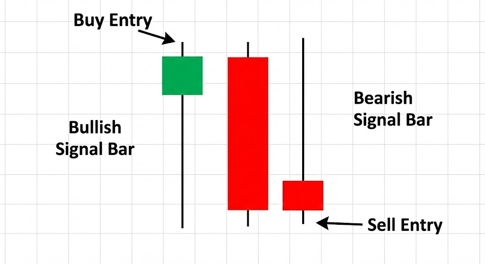
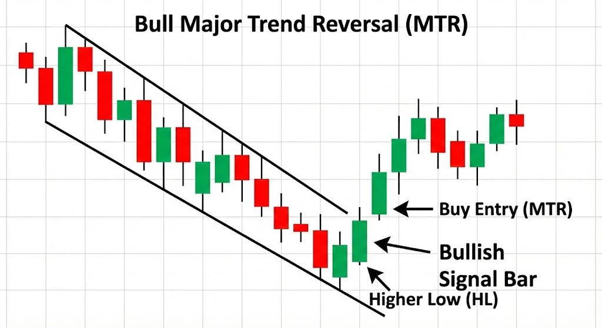
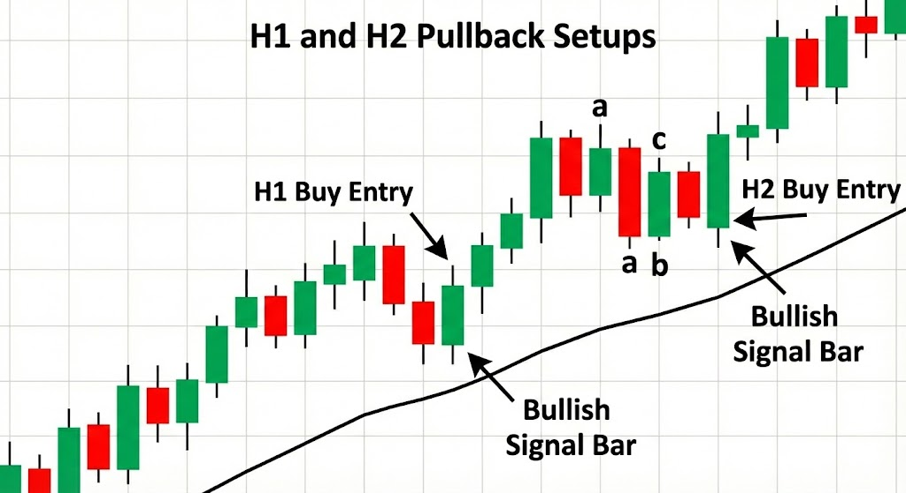

# trading-notes
**Al Brooks** is a well-known trader and educator who offers extensive training on **price action trading**, primarily through his **Brooks Trading Course** and a series of books.

His methodology focuses on reading price charts **bar-by-bar** without heavy reliance on traditional technical indicators, emphasizing market psychology, support/resistance, and pattern recognition. 

[Image of a candlestick chart illustrating basic price action concepts like trend, support, and resistance]

---

## 📚 Key Educational Content

Al Brooks's educational materials, including his course and books, cover a comprehensive range of price action concepts.

### 1. Brooks Trading Course (Video)

The video course is often seen as a more digestible way to learn the material found in his books. It's extensive and typically broken down into sections:

* **Getting Started:** Covers terminology, chart basics, and the psychology of successful traders.
* **Price Action:** This is the core content, including detailed analysis of:
    * **Signal Bars and Setups:** Identifying entry and exit signals.
    * **Market Cycles:** Understanding the shifts between trends and trading ranges.
    * **Trends, Channels, and Breakouts:** Recognizing the development and potential failure of movements.
    * **Pullbacks, Gaps, Support and Resistance:** Key market structures and magnets.
    * **Reversals and Wedges:** Identifying potential shifts in direction.
* **Bonus Section:** Often includes specialized topics like trading the open, end-of-day traps, and trade management.

### 2. The Book Series (Technical Analysis)

Brooks is also famous for his multi-volume book series on price action, which forms the theoretical foundation for his course material:

* ***Trading Price Action Trends:*** Focuses on identifying and trading strong directional moves.
* ***Trading Price Action Trading Ranges:*** Details strategies for trading when the market is moving sideways.
* ***Trading Price Action Reversals:*** Explores how to recognize and trade market turns.

---

## 📈 Core Concepts

The central idea behind Al Brooks's approach is that price action—the movement of a bar or candle—is a direct reflection of the battle between buyers (bulls) and sellers (bears). His key concepts include:

* **Reading Price Bar by Bar:** Analyzing every candlestick or bar to infer the current sentiment and probability of the next move.
* **Signal Bars:** Specific bars that provide entry or exit signals for a trade.
* **High/Low 1, 2, 3 Setups (MTRs):** Specific pullback/reversal patterns used for entries.
* **Measured Moves:** Projecting targets based on the length of previous legs or swings in the market.
* **The 80% Rule:** The observation that most breakouts from a Trading Range (TR) will fail, leading to an expectation of a return to the range.

The material is generally regarded as **highly detailed and dense**, often requiring significant time and dedication to master and apply effectively in real-time trading.

The entire course can be boiled down to understanding **Context** (where the market is) and recognizing **Setups** (how to enter and exit).

---

## 🦅 Al Brooks' Price Action: A Bird's-Eye View

Al Brooks argues that the market is always in one of two states, and a trader's job is to identify the shift between them.

| Market Environment | Description | Trading Focus |
| :--- | :--- | :--- |
| **Trend** | A series of price changes that are mostly up (Bull) or mostly down (Bear). Prices stay on one side of the Moving Average (MA). | Trading in the **direction of the trend** (with-trend scalps and swings), buying pullbacks, and looking for trend channel line breaks. |
| **Trading Range (TR)** | Prices oscillate in a relatively horizontal band, frequently crossing the MA. Bull and bear attempts constantly fail. | **Fading the extremes** (buying lows, selling highs) and scalping for small profits. |

> **CORE IDEA:** All movement, whether a Trend or a Trading Range, is a fractal pattern (repeating on every timeframe) and can be read *bar-by-bar* to determine the probability of the next move.

---
## 🎯 Key Concepts: Signal Bars and Setups

A **Setup** is a specific bar pattern that signals a potential trade. It is composed of a **Signal Bar** and an **Entry Bar** (often the bar *after* the signal bar).

### 1. The Signal Bar

The **Signal Bar (SB)** is the bar that tells you to prepare for a trade. It is the bar immediately preceding your entry.

| Type | Bullish Signal Bar | Bearish Signal Bar |
| :--- | :--- | :--- |
| **Ideal Form** | Closes near its high, with a large lower wick (tail) and a small or non-existent upper wick. | Closes near its low, with a large upper wick and a small or non-existent lower wick. |
| **Action** | Indicates that bears tried to push the price down but failed, and bulls took control, reversing the bar before the close. | Indicates that bulls tried to push the price up but failed, and bears took control, reversing the bar before the close. |
| **Entry** | You **buy one tick above** the high of the Signal Bar. | You **sell one tick below** the low of the Signal Bar. |

> **Context is King:** The quality of the setup is **80% Context** (Is the market at a key support/resistance level? Is this the second leg of a trend?) and **20% Signal Bar quality**. A great signal bar in bad context is a low-probability trade.

* **Bullish Signal Bar:** A bar with a small body near its high and a long tail below it. It shows that bears tried to push the price down, but bulls took control and reversed it.
* **Bearish Signal Bar:** A bar with a small body near its low and a long tail above it. It shows that bulls tried to push the price up, but bears took control and reversed it.

### 2. Major Trend Reversals (MTRs) - The Pattern

The **Major Trend Reversal (MTR)** is a powerful, high-probability setup that marks a transition from a Trend to a Trading Range, or even an opposite Trend. It almost always occurs after the current trend has had a **break of its Trend Line (TL)** and a **test of the extreme (High/Low)**.

#### Bull MTR Example (Reversal from Downtrend to Uptrend)

1.  **Downtrend (Bear Trend):** Price is making lower lows (LL) and lower highs (LH).
2.  **Trend Line Break:** Price moves significantly above the Bear Trend Line (TL).
3.  **Test of Low (Extreme):** Price pulls back to *retest* the prior low (or slightly below/above it). This test creates one of the classic MTR formations:
    * **Double Bottom (DB):** Two lows at the same price.
    * **Lower Low (LL) Trap:** Price makes a new low, but immediately reverses (a failed second leg down).
    * **Higher Low (HL):** Price makes a low that is higher than the previous low (the safest setup).
4.  **Signal Bar & Entry:** A strong **Bull Signal Bar** forms at the Higher Low (HL) or Double Bottom (DB) area. The trader buys one tick above the Signal Bar.

***

### 3. H1, H2, L1, L2 Setups (Pullbacks)

These are the most common entries *with* the trend, usually occurring during a pullback after a strong move (a **"flag"** pattern).

* **H1 (High 1):** The **first pullback** where price makes a new high above the previous bar's high in a bull trend. It's often a brief, one-legged correction. This is usually low probability because the first pullback is often brief and followed by a deeper test.
* **H2 (High 2):** The **second attempt** where price makes a new high above the previous bar's high in a bull trend. Trend to resume after a more complex, two-legged pullback (often called an "abc" correction). H2 setups are generally considered higher probability than H1 setups because the market often tests a reversal attempt twice.
    * ***Mirror Image for Bear Trends:*** the equivalent setups are **L1 (Low 1)** and **L2 (Low 2)**. You sell below the bar that triggers the L1/L2 setup.

---

## 🧠 The Trader's Mindset (Risk Management)

Brooks emphasizes that trading is a game of **probabilities**, not certainties.

* **Risk/Reward:** He often advocates for **scalping** (aiming for a small profit, like a $1 \text{ scalp}$ on the E-mini S\&P 500) where the probability is high (e.g., $60\%$ to $70\%$ win rate) but the reward is small, or **swing trading** where the Reward is at least $2 \text{ times}$ the Risk, allowing for a lower win rate (e.g., $40\%$ win rate) to still be profitable.
* **Stop Placement:** The protective stop should always be placed **one tick beyond the *worst-case* point of the pattern**, which is often the low/high of the entire reversal structure.
* **Trade Management:** Scalping involves taking profit quickly at a Measured Move or a key magnet (like the Moving Average or a prior extreme). Swing trades are held longer for a larger Measured Move.

Do you have a specific chart you are looking at right now, or would you like a deeper explanation of the **$80\%$ Rule** for trading ranges?