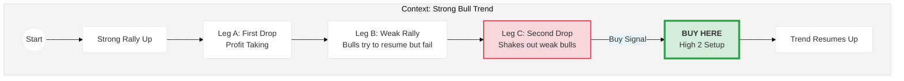
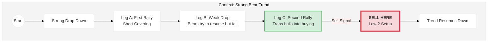

In Al Brooks' price action terminology, an **ABC Correction** is simply a **Two-Legged Pullback**.

It is one of the most reliable trade setups because it represents a complex pause in the trend that "shakes out" weak traders before the trend resumes.

### 📉 The Anatomy of an ABC Correction

An ABC correction consists of three distinct moves (waves) that run counter to the main trend. In a bull trend, ABC correction consists of 2 legs down and 1 leg up.

1.  **Leg A (The First Pullback):** The trend is strong, but traders begin to take profits. The price pulls back.
2.  **Leg B (The Failed Resumption):** Traders try to re-enter the trend immediately, but there isn't enough momentum yet. The price attempts to resume the trend but fails (creating a lower high in a bull trend).
3.  **Leg C (The Second Pullback):** The failure of Leg B scares traders, causing a second sell-off. This second leg usually drops slightly below Leg A, clearing out stops and finding "value" where institutional traders are waiting to buy heavily.

In Brooks' "Bar Counting" system:

  * **Bull Market:** An ABC correction is a **High 2 (H2)** buy setup.
  * **Bear Market:** An ABC correction is a **Low 2 (L2)** sell setup.

-----

### 1\. Bullish ABC Correction (Buy Setup)

*Market is trending UP.*

  * **Move A:** Price drops from the high.
  * **Move B:** Price rallies slightly but fails to make a new high.
  * **Move C:** Price drops again, often falling below the low of A.
  * **The Entry:** You place a **Buy Stop** order 1 tick **above** the high of the bar that finishes Leg C.

<!-- end list -->

**Why it works:** The "Leg C" drop traps bears into thinking the trend is reversing down. When the price turns back up, those bears are forced to buy to cover their losses, fueling the rally.

-----

### 2\. Bearish ABC Correction (Sell Setup)

*Market is trending DOWN.*

  * **Move A:** Price rallies from the low.
  * **Move B:** Price dips slightly but fails to make a new low.
  * **Move C:** Price rallies again, often going above the high of A.
  * **The Entry:** You place a **Sell Stop** order 1 tick **below** the low of the bar that finishes Leg C.

<!-- end list -->

**Why it works:** The "Leg C" rally traps bulls into thinking the market is reversing up. When the price turns back down, those bulls are trapped and must sell, fueling the drop.

-----

### 🧠 Al Brooks' "Leg Counting" Shortcut

If identifying "ABC" is difficult in real-time, Al Brooks suggests simply counting the attempts to reverse the trend.

  * **Leg A** is the **1st attempt** to reverse the trend (creating a High 1 or Low 1).
  * **Leg C** is the **2nd attempt** to reverse the trend.

**Rule:** Traders generally **do not** take the 1st signal (Leg A/High 1) because it often leads to a complex correction. They wait for the **2nd signal (Leg C/High 2)** because the probability of the trend resuming is much higher.
