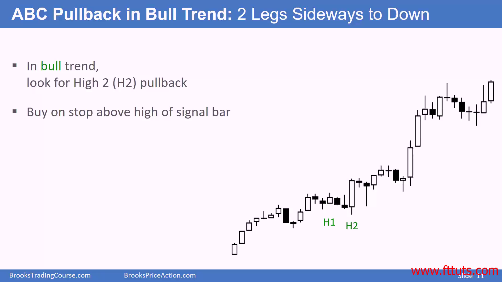

## 所有的市场，在任一时刻要么是在一个趋势中，要么是在一个交易区间中
- 一半牛市趋势是由一个突破长 k 线开始的
- 交易区间最终会有突破的k线，继续之前的趋势或者reverse反向之前的趋势
  - 如果k线突破失败，那么价格将会继续交易区间
  - 如果k线突破成功，那么会形成新的趋势

- k线分为：趋势k线 - 影线比本体短（开收价基本就是区间的高低点），区间k线：影线比本体长。
  - 我们可以把趋势k线本身看作一个短时的趋势，区间k线看作一个短时的区间

- 散户交易者偏好技术分析，机构偏好基本面分析。但是基本面分析也会看图表，并不少完全不看的

---
- ABC回调趋势：两腿回调k线，然后继续趋势。下单方式是通过在高bar上的止损单下的  
参考 [h1-h2-more-explained](./h1-h2-more-explained.md)

- Flag 旗形态