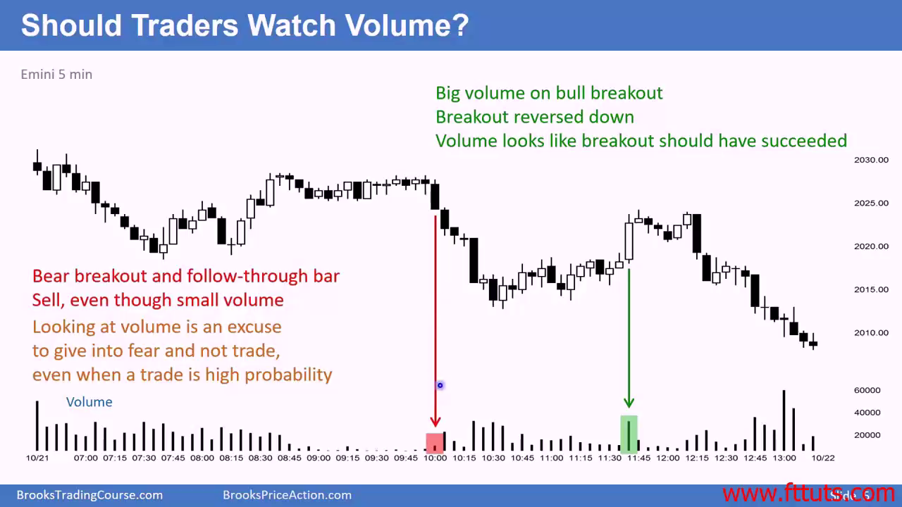

> NOTE: No volume in forex markets, so vol is irrelevant for forex traders
## 量价背离 - 价格越低反而成交量越小
- 当价格跌📉，成交量也随之跌📉的情况下，市场会停止向下，
  - 因为市场总是朝着成交量最大的方向移动
  - 此时市场要么反弹，要么横向在低位震荡
    - 如果横向低位震荡情况下，卖家/空方看到反弹有局限（多方势能不足），那么他们又会经常挂卖单，继续把价格往下推，直到多空双方力量相平衡为止（此时成交量也最大）
      - 成交量变小并不代表价格就一定会向上
- 这并不是一个可靠的交易形态，发生的次数太少（可能一周一次），而且你要时时刻刻盯着分钟线的屏幕
- 理论上来说，如果价格一直向下，那么将不会有任何交易发生

## 交易量真的是可靠的指标吗？交易员真的要看 volume chart 吗
- 当k线的价格行为 setup 非常非常好 (high probability trade)，但volume 低的时候，你作为交易员会怀疑这个setup 是否可靠，从而不进行交易；
- 当k线的 setup 不太好 (low probability trade)，但volume 比较高的时候，你作为交易员会相信这个 setup 是可靠的，进行交易

- Volume is misleading in above example

- 大的趋势k线总是伴随着高成交量，不需要看成交量图也能知道重要的事情发生了
- 大成交量不是可靠的指标，volume is a false god, that beginners hope will protect them from painful loss

- 外汇市场没有任何成交量指标
  - 如果成交量对于交易员这么重要，为什么外汇交易员还能挣钱呢

## 成交量一个重要的应用方式是 Tape reading - Depth of market traders
> Level 2 tape reading is a day trading technique analyzing the Level 2 order book (bids and asks) to see market depth and pending orders, revealing supply/demand imbalances to predict short-term price moves, unlike traditional charts that show completed trades; it's best used with Time & Sales (the "tape") for real-time transaction confirmation, identifying support/resistance, and gauging buyer/seller intent. 
- DOM 交易员看盘口深度和有限的 level 2 data 的 bid ask order size 去决定开仓和平仓时机，他们不看 k 线
- 交易策略是：追随大订单的方向。大订单会出现，也会消失（被吃掉了或者取消）
- 这种交易方式在 20 年前有效，因为那个时候大部分的交易单不是自动撮合的，需要broker 在中间撮合，还需要打电话下单，市场有很多错误，可以来套利
- 现在这种交易方式不流行了，因为市场没多少错误和套利空间了，仅仅看每个价格的订单就可以套利
- IB level2  shows market orders as well as limit orders
