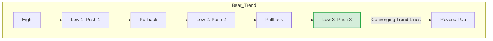
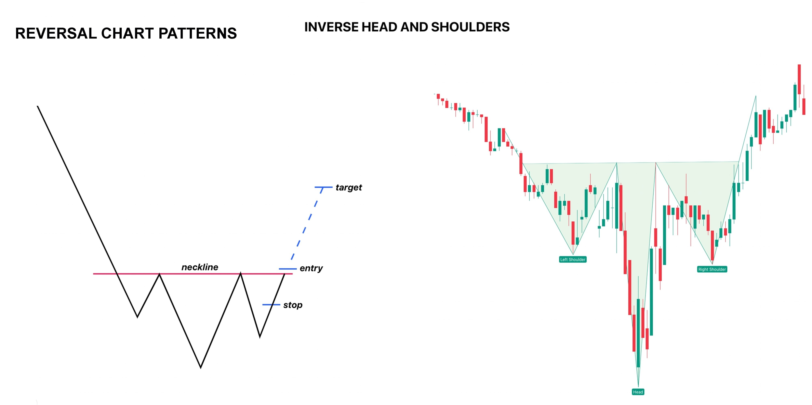

# What is wedge bottom and head and shoulders bottom

These are two of the most reliable **Reversal Patterns**. In the Al Brooks framework, they mark the end of a Bear Trend and the start of a Bull Trend (or at least a Trading Range).

Here is the breakdown, keeping your automation goal in mind.

---

### 1. The Wedge Bottom (The "Three Push" Pattern)

A **Wedge Bottom** is a bullish reversal pattern that looks like a funnel tilting down.

**The Anatomy:**

* **Shape:** The price makes **Lower Lows** (it's still going down), but the moves are getting weaker.
* **The Lines:** If you draw a line connecting the highs and a line connecting the lows, they **converge** (point towards each other).
* **The Count:** Al Brooks defines a wedge simply as **"Three Pushes Down."**
1. Push 1 (Selloff)
2. Pullback
3. Push 2 (Selloff, usually a new low)
4. Pullback
5. Push 3 (Final Selloff, usually a lower low)


**Al Brooks' Logic:**
The bears are trying to push the price down, but every time they make a new low, the buyers step in faster. By the 3rd push, the bears are exhausted, and the bulls take over.

**Real-World Analogy: The Spring**
Imagine compressing a spring.

* **Push 1:** You push it down. (Easy).
* **Push 2:** You push it deeper. (Harder, it pushes back).
* **Push 3:** You push it to the max. (Very hard).
* **Snap:** If you let go, it snaps back up violently.



**Automation Note:**
Detecting a wedge programmatically involves identifying 3 swing lows where `Low3 < Low2 < Low1`, but the *angle* of descent is shallowing (momentum divergence).

---

### 2. Head and Shoulders Bottom (Inverse H&S)

This is the classic "King of Reversals." In Al Brooks' terminology, this is a specific type of **Major Trend Reversal (MTR)**.

**The Anatomy:**
It consists of three "valleys":

1. **Left Shoulder (LS):** A standard bear trend low.
2. **Head (H):** A push to a **Lower Low** (the final exhaustion of the bears).
3. **Right Shoulder (RS):** A **Higher Low**. This is the critical moment. The bears tried to push price down again but *failed* to reach the Head's low.

**Al Brooks' Logic:**
The "Right Shoulder" is actually a **Higher Low Major Trend Reversal**. It signifies that the Bear Trend (making lower lows) is officially broken because the market has just made a *Higher Low*.

**Real-World Analogy: The Tired Runner**

* **Left Shoulder:** The runner trips and falls.
* **Head:** He gets up, runs, and crashes even harder (lowest point).
* **Right Shoulder:** He tries to get up, stumbles, but catches himself *before* hitting the ground. He has found his footing.
* **Neckline Break:** He starts sprinting again.

```mermaid
graph TD
    A[Bear Trend] --> B[Left Shoulder (Low)]
    B --> C[Rally]
    C --> D[HEAD (Lower Low)]
    D --> E[Rally to Neckline]
    E --> F[Right Shoulder (Higher Low)]
    F -- "Breakout" --> G[Bull Trend Begins]
    
    style D fill:#f8d7da,stroke:#dc3545
    style F fill:#d4edda,stroke:#28a745

```

**Automation Note:**
Your bot should look for this sequence: `Low_1 (LS)` -> `Low_2 (Head) < Low_1` -> `Low_3 (RS) > Low_2`. The entry is on the break of the **Neckline** (the high between the Head and RS).

---

### ⚔️ Comparison: Are they the same?

Often, yes.

* A **Wedge Bottom** is frequently the *first part* of a reversal. It stops the drop.
* A **Head and Shoulders Bottom** is the *structure* of the reversal itself.
* **Connection:** The "Head" of a Head and Shoulders pattern is often a Wedge Bottom on a smaller timeframe!

**Hierarchy Position:**
`Market Phase -> Reversal Patterns -> Wedge (Exhaustion) -> Head & Shoulders (Transition)`