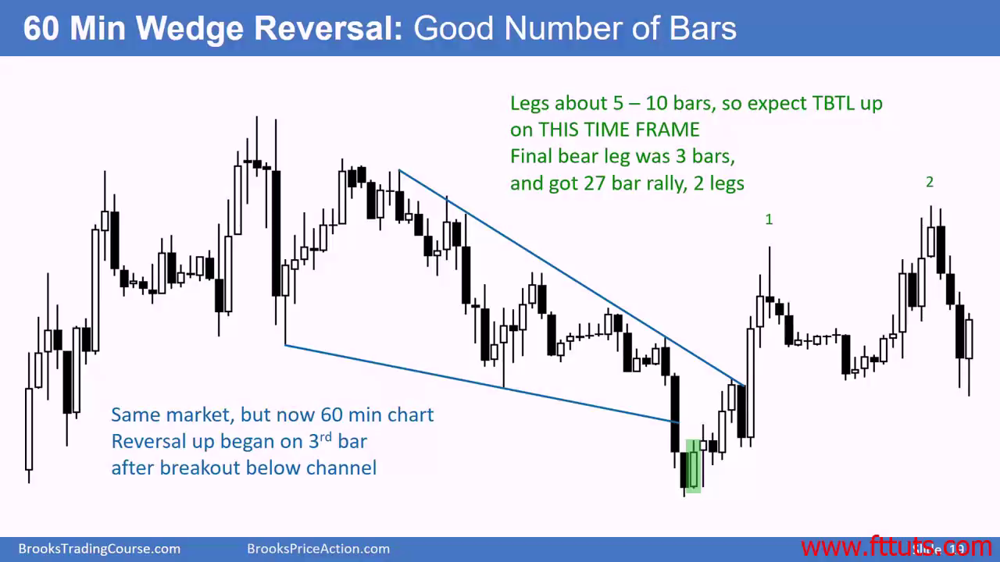
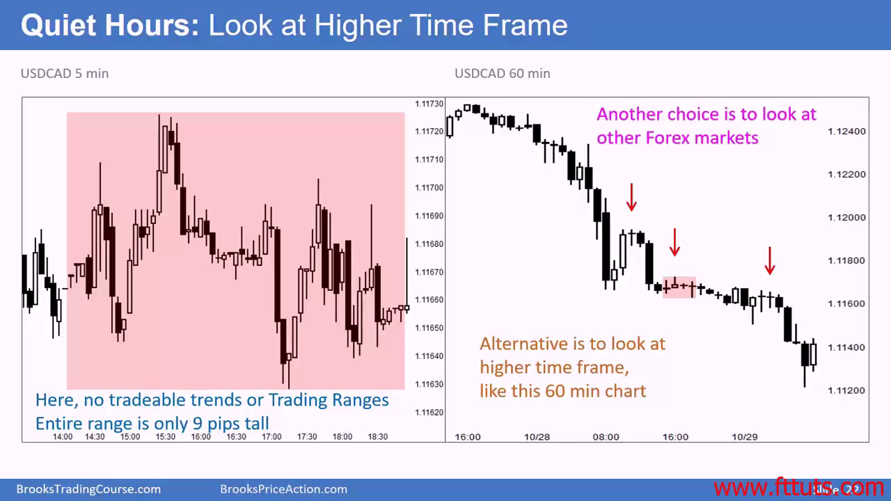
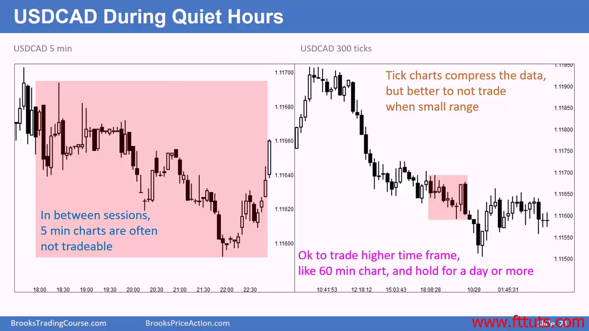
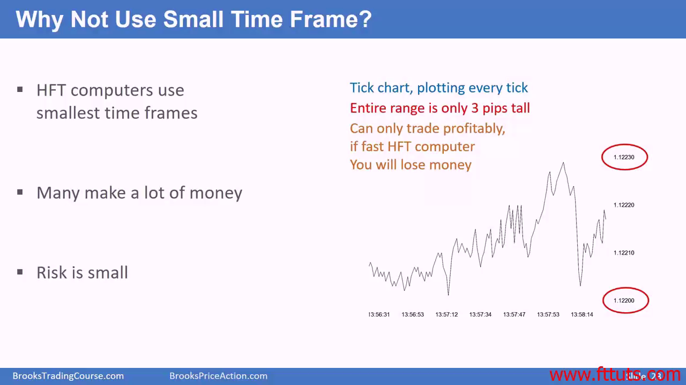

# 该选择什么时间尺度的图表？

避免选择 1/2/3 分钟图表，至少选择5分钟图表。不然你需要在短时间作太多选择，看不过来，也反应不过来。

5分钟以上的图表价格行为都能work。

- 选择能让你感到最舒服的，最短时间的k线图表
- 超短线一般持仓不超过5根k线
- 波段交易者持仓在5-20根k线之间

## 如何选择一个合适/舒适的分时图表

- 看最高的时间表格，图形有明显的趋势而且每条腿有差不多是5-10根k线的长度，这样的图表看起来舒服一些

- 如果5分钟的k线太密集了的话（每条腿几十根的k线），那么可以切换到30分钟k线图表

## 不要觉得你能手动做超短线（ < 1min 的图表），最终结果就是你账户价值会在不断的市场震荡中损耗

