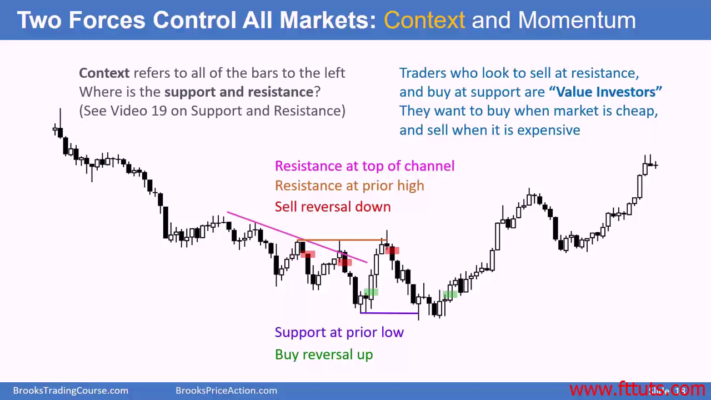
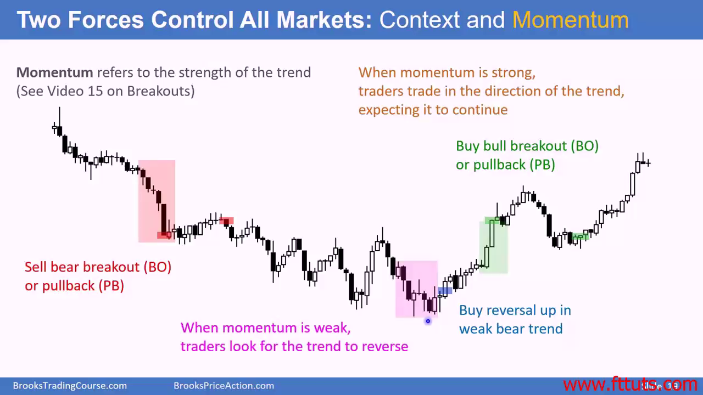

# 2 forces control all markets: context and momentum

## Context is all that happen to the left, used to identify support/resistance and trends

Value investors buy "cheap" and sell "expensive" - buy support and sell resistance

## Momentum - used to identify reversals

When momentum is weak, traders look for reversals

- Smaller bear candle body
- longer tails
- widening trading range

