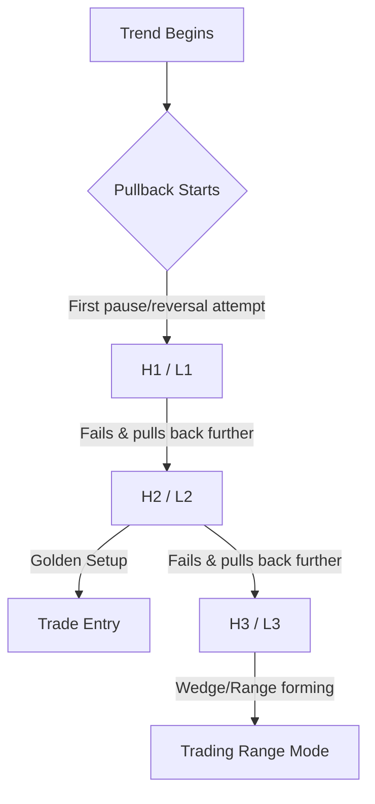
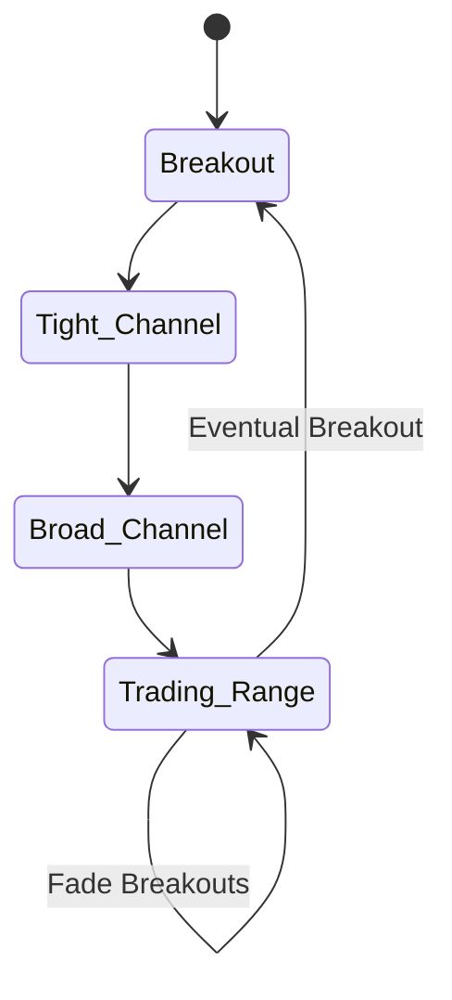

Since you are looking to **automate** or **apply** these concepts elsewhere (like Steve Dux's short-biased strategies), you need to strip away the "art" and look at the **logic** and **rules**. Al’s system is essentially a giant decision tree, which is perfect for an algorithmic approach if you define the variables strictly.

Let's break down the core mechanics you asked about using analogies and clear logic.

-----

### 1\. Bar Counting (High/Low 1, 2, 3, 4)

This is the heartbeat of Al's pullback trading. It is essentially a way to quantify **counter-trend attempts**.

**The Logic:**
Trends don't move in straight lines; they breathe.

  * In a **Bull Trend**, bears try to reverse the market down. They usually fail.
  * **H1 (High 1):** The *first* time the bears pause and the bulls try to resume the trend.
  * **H2 (High 2):** The *second* time bears try to reverse it and fail. This is often the "sweet spot" because it forms an **ABC correction** (two legs down).
  * **H3/H4:** By the 3rd or 4th attempt, the trend is likely losing energy and morphing into a Trading Range.

**The Real-World Analogy: The Door-Breach**
Imagine a SWAT team (the Bulls) trying to break down a door (Resistance).

  * **H1:** They hit the door once (first pullback). It rarely breaks open on the first hit. It's risky to bet on this one.
  * **H2:** They step back and hit it a second time (second leg). The door is weakened. This is the highest probability moment it will break (Trend Resumption).
  * **H3/H4:** If they have to hit it a 3rd or 4th time, they are getting tired. The operation is becoming messy (Trading Range).

**Visualizing the Count:**

  * A **High 1** is the first bar in a pullback whose *High* is above the prior bar's *High*.
  * A **Low 1** is the first bar in a pullback (up) whose *Low* is below the prior bar's *Low*.

<!-- end list -->

**Connection to Steve Dux/Shorting:**
Steve Dux often shorts "parabolic" moves on penny stocks. In Al Brooks' terms, Dux is looking for a **Climax** followed by a **Low 2 (L2)** short. The first dip (L1) usually gets bought up by dip-buyers. Dux waits for that bounce to fail (L2) before shorting heavily.

**Hierarchy Position:**
`Market Cycle (Trend) -> Pullback Phase -> Setup (Bar Counting) -> Signal Bar`

-----

### 2\. Magnets (Measured Moves & Support/Resistance)

If you are building an automated system, "Magnets" are your `Profit Target` variables. Price often accelerates *toward* them and reverses *at* them.

**The Logic:**
The market seeks liquidity. Algorithms are programmed to take profits at mathematical projections. When Al says "Measured Move," he means the market often moves in symmetrical legs.

**The Real-World Analogy: GPS Waypoints**
When driving (trending), you don't just drive indefinitely. You drive to a specific destination (Waypoint A). Once you hit it, you stop, check the map, and decide whether to go to Waypoint B or turn around.

  * **Measured Move (MM):** If the market moved up $10, pulled back, and resumed, it will likely move up another $10.

**Common Automated Targets:**

1.  **Leg 1 = Leg 2:** The height of the second leg equals the height of the first.
2.  **Trading Range Height:** If a range is 20 points tall and breaks out, the target is 20 points up/down.

**Hierarchy Position:**
`Always In Direction -> Trade Management -> Profit Taking -> Magnets (Support/Resistance)`

-----

### 3\. Market Cycle: The Four Phases

For an automated system, defining the **Market Cycle** is the most critical step. A "High 2" buy works great in a Trend but will destroy your account in a Trading Range.

**The Logic:**
The market evolves in a standard lifecycle.

1.  **Breakout (Spike):** Violent, fast move. (High probability, low risk).
2.  **Tight Channel:** The momentum slows but direction is clear.
3.  **Broad Channel:** Two-sided trading begins, deeper pullbacks.
4.  **Trading Range:** Confusion. Bulls and Bears are balanced. (Buy Low, Sell High).

**The Real-World Analogy: A Runner**

1.  **Breakout:** The sprint at the start of the race. (Explosive energy).
2.  **Tight Channel:** Settling into a fast, steady pace.
3.  **Broad Channel:** The runner gets tired, starts stumbling a bit, pace fluctuates.
4.  **Trading Range:** The runner stops to catch their breath and walks in circles.

**Automated Signal Filter:**

  * *If Market = Breakout:* Buy/Sell at market (don't wait for pullbacks).
  * *If Market = Trading Range:* Fade breakouts (Buy Lows, Sell Highs). **Do not use H1/H2 trend entries here.**

<!-- end list -->

**Hierarchy Position:**
`Price Action -> Market Cycle (Context) -> Strategy Selection`

-----

### 4\. The "Trader's Equation" (Automation Math)

Al Brooks constantly refers to the "Trader's Equation." This is purely mathematical and fits perfectly into your algorithmic approach.

$$\text{Probability} \times \text{Reward} > \text{Risk}$$

  * **Scalping (Trading Ranges):** High Probability ($60\%+$), Low Reward (1:1).
  * **Swinging (Trends/Breakouts):** Lower Probability ($40\%-50\%$), High Reward (2:1 or 3:1).

**Mentor Note:** When you watch Dux or other short-sellers, they often have a **high win rate** (Probability) but one bad trade can hurt (Risk). Al teaches you to balance this. If you automate a system with a 40% win rate, your code *must* ensure the winners are 2x the size of losers, or you will bleed to death.

**Hierarchy Position:**
`Trade Management -> Risk Management -> Trader's Equation`
