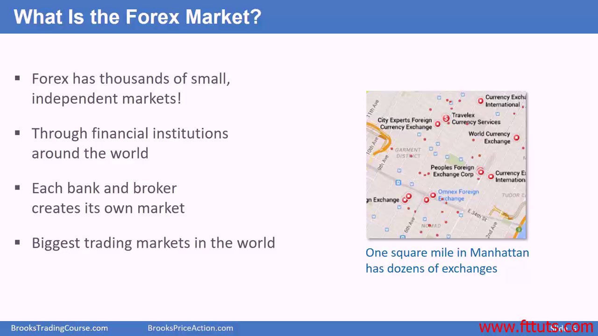
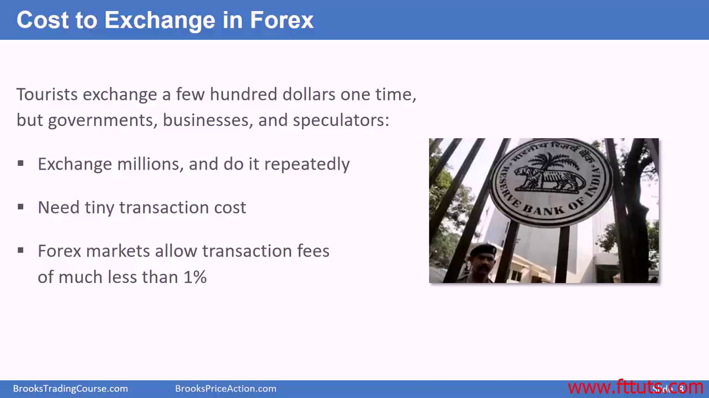
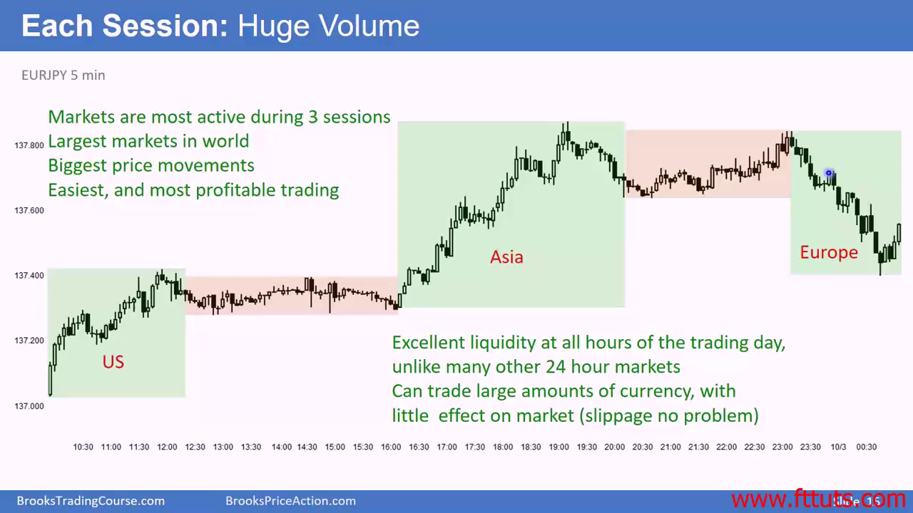

# Forex trading

## Why trade forex? Forex market is decentralized

## Why trade forex? Transaction cost is low

外汇有三个主要时区，北美，欧洲和亚洲。如果他们重叠起来，那么可以看作一个大时区

## Forex has good between session volume

## Forex in session volume is huge

