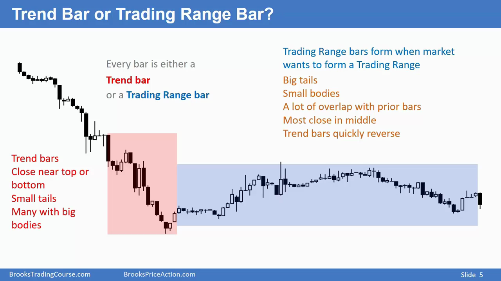
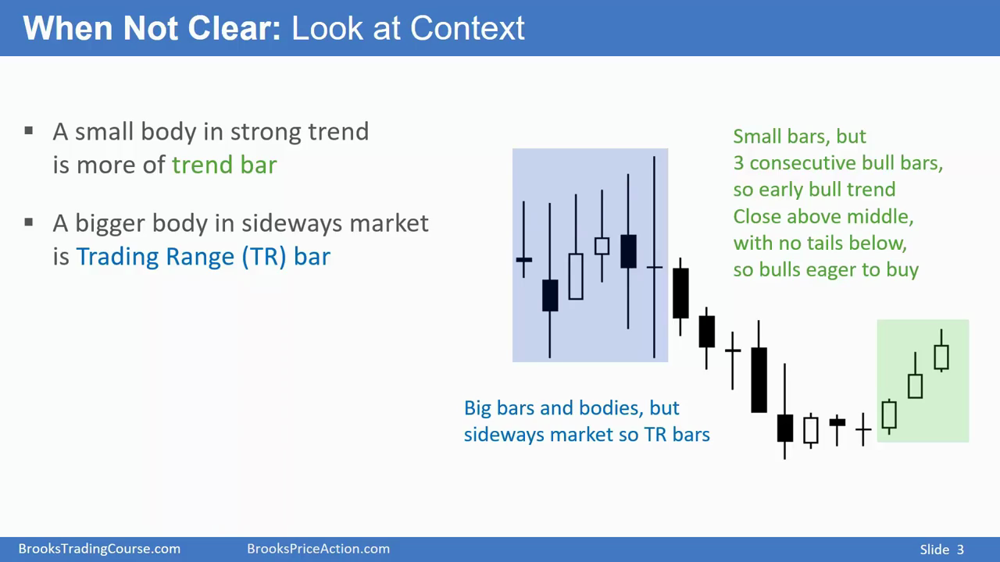

# 市场图形学：分形

## 价格图形本质是分形的。每个k线在低时间维度来看都是 trading range 或者一个趋势线

- trend bar: big body, small tails
- trading range bar: small body, big tails

当你不确定一个k线是 trend 还是 trading range 时候，你需要看上下文（左边的k线）。如果在一个趋势中，那么即使十字形k线也是 trend bar

Market itself is fractal, bigger patterns are made up of smaller patterns

On monthly chart, Bars are bigger, so you have to trade relatively smaller position rather than large positions
for trading purpose.
