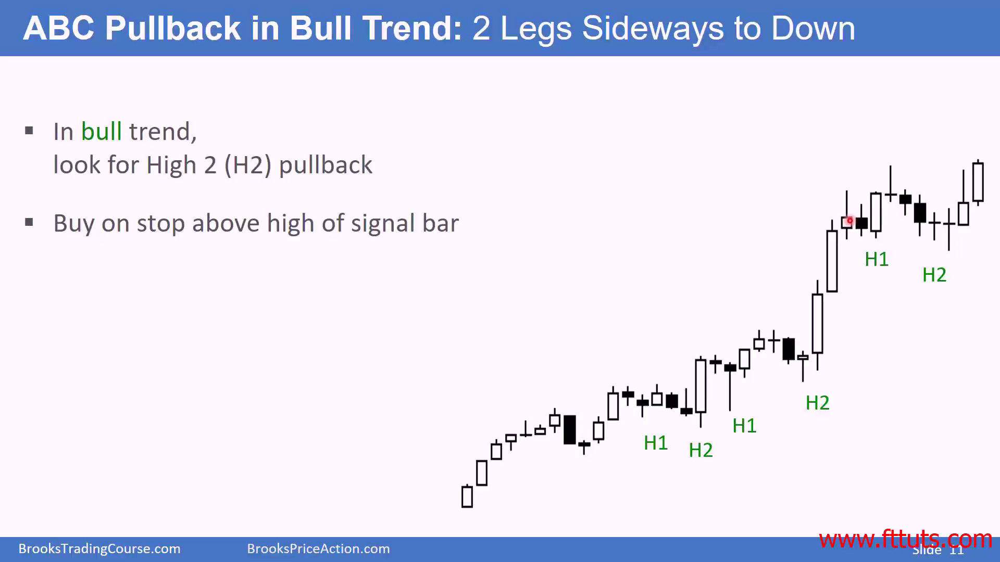
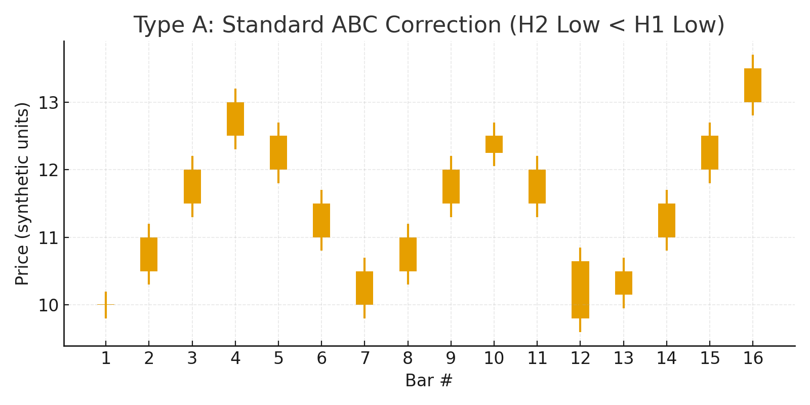
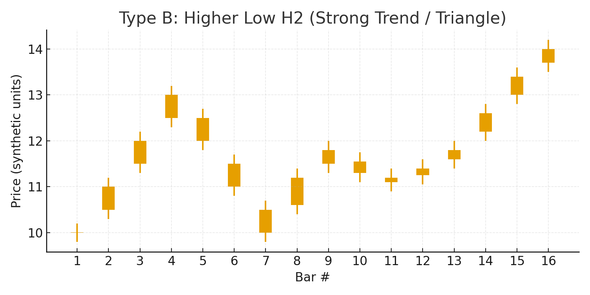

> During a pullback in bull trend (bull flag), if following occurs: a bar with a high above its prior bar, then the prior bar is an H1 signal bar. H1 is bottom of the bull flag or near the bottom of a trading range. The bar with a high above the prior bar is actually the entry bar for the H1 signal bar

> H1 就是牛趋势中的熊回调的第一次拉高操作，first reversal up after breakout to high, H2 就是熊回调的第二次拉高操作；如果出现任何较大的突破都要重新计数

> 操作：止损点在 H1/H2 低点 - 1 tick，入场在 H1/H2 高点 + 1 tick

> H1/L1 in trading ranges are less applicable since using wide stops make more sense in trading ranges and to scale in!

> https://www.reddit.com/r/Daytrading/comments/1hgxowd/how_to_know_the_difference_between_a_lower_high/



### 1. The Bull Signal Bar

* **The Bull Signal Bar:** In a pullback, the signal bar itself typically has a **High that is LOWER than the previous bar's High**. This confirms that the pullback is still in effect (price is pausing or dropping).
* **The Entry:** The trade is triggered only when the **Next Bar (Entry Bar)** goes **above** the High of that Signal Bar.

It is a critical distinction: the signal bar *is* the pause; the entry bar *breaks* the pause.

---

### 2. The H2 Anatomy: Pullbacks and Ceilings
> *"Does an H2 entry have two pullbacks preceding it?"*

Yes. An H2 is, by definition, a **Two-Legged Pullback**.
* **Leg 1:** The first drop (leads to an H1).
* **Leg 2:** The second drop (leads to an H2).

> *"What is the typical ceiling that rejects the H1 and creates the H2?"*

The "ceiling" that causes the H1 to fail is usually the **Prior Extreme (Trend High)**.
Al Brooks calls this a **Double Top Bear Flag** or simply a **Lower High**.

**The Sequence of Failure:**
1.  **Trend High:** The market hits a peak (e.g., 100).
2.  **Leg 1 Down:** Market drops to 98. (H1 Signal forms).
3.  **The Attempt (The H1 Entry):** Bulls buy at 98. They try to push price back up to 101.
4.  **The Ceiling (Failure):** The price rallies to 99.50 or 100 but **cannot break through**. The Bears sell at this Double Top/Lower High.
5.  **Leg 2 Down:** The bulls give up, and price flushes down to 97. (This sets up the **H2**).

---

### 3. Strategy: Can you trade both H1 and H2?
> *"Is it okay to create buy order in both H1 and H2 setup in a bull trend?"*

**Yes, but it depends entirely on the Market Cycle (Context).**

#### Scenario A: The Strong Spike (Buy Both)
If the market is in a **Strong Breakout (Spike)** phase where bars are large, closing near highs, and far above the Moving Average (EMA):
* **Action:** You can buy the **H1**.
* **Why:** In a spike, pullbacks are often tiny (1-2 bars). Waiting for an H2 means you will miss the trend because the H2 often never comes.

#### Scenario B: The Channel / Broad Channel (Wait for H2)
If the market is in a **Channel** (slower trend, two-sided trading, overlap):
* **Action:** **Skip the H1.** Wait for the H2.
* **Why:** In channels, the First Entry (H1) fails 50% of the time. It is a "Bull Trap." The market usually needs to "shake the tree" twice (Two Legs) before it has enough energy to go higher.

#### The "Scale-In" Approach (Advanced)
Many institutional traders (and Al Brooks himself) will:
1.  **Buy the H1** (Small size).
2.  **Use a Wide Stop** (below the start of the trend leg, not below the signal bar).
3.  **Buy MORE at the H2** (Scaling in lower).
4.  **Exit** at the original H1 entry price (Breakeven on first trade, Profit on second) or hold for new high.

**Mentorship Advice for Automation/New Students:**
If you are building a bot or learning, **do not take H1s** unless the trend is exceptionally strong (e.g., ADX > 25 or price is >10 ticks from EMA). The **H2 is the "Money Setup"** because the probability is significantly higher.

**Hierarchy Position:**
`Setup Selection -> Trend Strength Analysis (Spike vs Channel) -> Order Management (Scaling In)`

---
> Draw an ascii diagram to illustrate The "Scale-In" Approach (Advanced), clarify the points 1) "Use a Wide Stop" and 2) **Buy MORE at the H2** (Scaling in lower). Also answer the question: In a bull trend, Is H2 always lower than H1 or it depends on context?
This is a great question for someone looking to automate or refine their strategy. The "Scale-In" approach is how institutional traders manage risk, and it's very different from the typical retail "stop-loss just below the bar" method.

Here is the ASCII diagram and clarification of the concepts.

### The Al Brooks "Scale-In" Approach (Advanced)

This strategy is based on the premise that the trend is strong and a deep pullback is a buying opportunity, not a reversal. You are betting on the **trend structure** holding, not just a single bar.

**ASCII Diagram: Bull Trend Scale-In**

```text
      (Trend High)
          /
         /
(Leg 1) /
       /
  [ENTRY 1: H1 Buy]  <-- Small Position (e.g., 1 Contract)
       \
        \
(Leg 2)  \  (Deeper Pullback)
          \
           \
  [ENTRY 2: H2 Buy]  <-- Larger Position (e.g., 2 Contracts)
            \
             \
[WIDE STOP LOSS] ---------------- (Below Major Swing Low / Trend Start)
```

### Clarification of Key Points

#### 1\. "Use a Wide Stop"

  * **Retail Thinking:** Place the stop loss 1 tick below the signal bar's low. If the market wiggles, you get stopped out for a small loss.
  * **Al Brooks/Institutional Thinking:** The exact low of the signal bar is noise. The **trend** is defined by its major swing lows. As long as the market is above the *start* of the current trend leg, the bull trend is alive.
  * **The Logic:** Your stop is placed at a point where, if hit, the **entire premise of the bull trend is invalidated**. This is usually below a major support level, a prior swing low, or the bottom of a strong breakout spike.
  * **For Automation:** You would identify the `Lowest_Low_Last_20_Bars` or the `Start_of_Trend_Spike_Price` and place your hard stop there. It will be far away, so your initial position size must be small to keep dollar risk constant.

#### 2\. "Buy MORE at the H2" (Scaling in Lower)

  * **The Logic:** You bought the H1 because the trend is bullish. The market dropped further to form an H2. This means you are getting a **better price** in a market you still believe is bullish.
  * **The Action:** Instead of panicking, you add to your position. Often, traders will double their size on the second entry.
  * **The Goal:** By adding lower, you lower your **average entry price**.
      * Entry 1 at $100 (1 unit)
      * Entry 2 at $98 (2 units)
      * **Average Entry:** $(100 + 98 + 98) / 3 = \$98.66$
  * **The Exit Strategy:** The market only needs to rally slightly above your new average entry ($98.66) for you to get out at breakeven on the whole trade. If it rallies back to the original H1 high, you make a significant profit.

-----

### Is H2 always lower than H1 in a bull trend?

**No, not always.** It depends on the type of pullback.

There are two main types of two-legged pullbacks:

#### Type A: The Standard "ABC" Correction (Lower H2)

This is the most common and what I diagrammed above. The market makes a lower low.

  * **H1 High:** $102
  * **H1 Low:** $100
  * **H2 High:** $101
  * **H2 Low:** $99 **(Lower than H1 Low)**
  * *Context:* Typical profit-taking in a healthy trend.

#### Type B: The "Higher Low" Pullback (Higher H2)

This happens in very strong trends where bulls are so eager they don't let the price drop far.

  * **H1 High:** $102
  * **H1 Low:** $100
  * **H2 High:** $102.50
  * **H2 Low:** $101 **(Higher than H1 Low)**
  * *Context:* Often forms a small **Wedge Bull Flag** or a **Triangle**. The market pauses, goes sideways-to-up, and then breaks out.

**Mentor Tip for Automation:**
Your code for identifying an H2 should not strictly require `H2_Low < H1_Low`. Instead, it should look for the *sequence* of events:

1.  Pullback starts.
2.  Attempt to resume fails (creating a local lower high or double top).
3.  Another pause/pullback bar forms (this is the H2 signal, regardless of its absolute low).

**Hierarchy Position:**
`Trade Management -> Risk Management -> Position Sizing -> Scaling In (Advanced)`


---
> Generate ascii charts illustrating, labeling h1 h2 highs and lows, also label pullbacks and entry/exits:
> 1. Type A: The Standard "ABC" Correction (Lower H2)
> 2. Type B: The "Higher Low" Pullback (Higher H2)

This is a perfect request to solidify your understanding of market structure for automation. The difference between these two patterns is often the difference between a "Trend" algorithm and a "Trading Range" algorithm.

Here are the ASCII charts illustrating the two types of H2 setups in a Bull Trend.

### 1\. Type A: The Standard "ABC" Correction (Lower H2)

This is the classic, deep pullback. The market flushes out weak holders by dropping below the first pullback's low. This is the most common H2 and the one I diagrammed previously.

**Characteristics:**

  * **H2 Low** is LOWER than **H1 Low**.
  * Represents a healthy "reset" in a trend.




### Example Logic Hooks (Type A)

You can wire these into your algo conditions:

* Detect H1:

  * First swing low after a strong bull leg → `H1_Low`
* Detect H2:

  * Second swing low after H1 where
    `H2_Low_Price < H1_Low_Price`
* Trade:

  * Long when a bar (`H2_signal_bar`) closes bull after H2
    **and** next bar breaks its high.
  * Stop below `H2_Low`.
  * Exit rule as you like (measured move, R-multiple, etc.)


-----

### 2\. Type B: The "Higher Low" Pullback (Higher H2)

This pattern forms in **very strong trends** where bulls are so eager to buy that they don't allow the price to drop back down to the prior low. It often looks like a small **triangle** or a **tight flag**.

**Characteristics:**

  * **H2 Low** is HIGHER than **H1 Low**.
  * Indicates massive buying pressure; the breakout from this is often explosive.



### Example Logic Hooks (Type B)

* Same swing detection as Type A, **but** classification is:

  ```pseudo
  if H2_Low_Price > H1_Low_Price:
      pattern_type = "TypeB_StrongTrend"
  ```

* Trade behavior adjustments for your bot:

  * Expect **fast spike** → consider:

    * Tighter trailing stop after entry.
    * Maybe partial take-profit on first large spike bar.
  * Avoid short setups into this pattern (classify as “do not short” zone).

### 🧠 Mentor Notes for Automation:

1.  **Coding the Difference:** Your bot can easily distinguish these.

      * `If H2_Low_Price < H1_Low_Price`: Treat as **Type A** (Standard Pullback).
      * `If H2_Low_Price > H1_Low_Price`: Treat as **Type B** (Strong Trend / Triangle).

2.  **Why it Matters:**

      * **Type A** often leads to a standard measured move up.
      * **Type B** often precedes a violent, fast breakout spike. You might want your bot to use a *tighter trailing stop* once a Type B trade triggers, to capture the quick burst of momentum.

3.  **Steve Dux Connection:** Dux hates seeing Type B patterns when he is looking to short. A higher low after a pullback is a sign that the buyers are stepping up their aggression, and a squeeze is imminent. He would likely avoid shorting this or would stop out quickly if he were in.

---


## How You Might Use This In Code

Very rough sketch, language-agnostic:

```pseudo
for each bar:
    detect_swing_high_low()

    if new_swing_low and no_H1_yet and inBullTrend:
        mark H1_Low = low(bar)

    elif new_swing_low and H1_Low_set and no_H2_yet:
        H2_Low = low(bar)
        if H2_Low < H1_Low:
            pattern = "TypeA"
        else if H2_Low > H1_Low:
            pattern = "TypeB"

    if pattern in ["TypeA","TypeB"] and bullish_signal_after_H2 and break_above_signal:
        enter_long()
```

---
## Appendix: python3 matplotlib `type_A_H2_candles` `type_B_H2_candles`
```py3
import matplotlib.pyplot as plt
import pandas as pd
import numpy as np

# Helper to make a simple candlestick-like plot without special libraries
def plot_scenario(ohlc, title):
    df = pd.DataFrame(ohlc)
    fig, ax = plt.subplots(figsize=(8, 4))
    
    x = np.arange(len(df))
    width = 0.4  # candle body width
    
    for i, row in df.iterrows():
        # wick
        ax.vlines(x[i], row['Low'], row['High'])
        # body
        open_ = row['Open']
        close_ = row['Close']
        bottom = min(open_, close_)
        height = abs(close_ - open_)
        rect = plt.Rectangle((x[i] - width/2, bottom), width, height if height != 0 else 0.01)
        ax.add_patch(rect)
    
    ax.set_xticks(x)
    ax.set_xticklabels(df['Bar'])
    ax.set_xlabel("Bar #")
    ax.set_ylabel("Price (synthetic units)")
    ax.set_title(title)
    ax.grid(True, linestyle='--', alpha=0.3)
    plt.tight_layout()
    return fig, ax

# Construct synthetic OHLC for Type A: deeper second pullback (H2 < H1)
bars_A = list(range(1, 17))
prices_A = [
    10, 11, 12, 13,   # trend up
    12, 11, 10,       # PB1 down to H1 low (bar 7)
    11, 12, 12.5,     # bounce
    11.5, 9.8,        # PB2 deeper to H2 low (bar 12 < bar 7)
    10.5, 11.5, 12.5, 13.5  # trend resumes
]

ohlc_A = []
for i, p in enumerate(prices_A):
    if i == 0:
        prev_close = prices_A[0]
    else:
        prev_close = prices_A[i-1]
    # small body around the target price p
    open_ = (prev_close + p) / 2
    close_ = p
    high = max(open_, close_) + 0.2
    low = min(open_, close_) - 0.2
    ohlc_A.append({"Bar": bars_A[i], "Open": open_, "High": high, "Low": low, "Close": close_})

fig1, ax1 = plot_scenario(ohlc_A, "Type A: Standard ABC Correction (H2 Low < H1 Low)")

# Construct synthetic OHLC for Type B: higher low second pullback (H2 > H1)
bars_B = list(range(1, 17))
prices_B = [
    10, 11, 12, 13,   # trend up
    12, 11, 10,       # PB1 down to H1 low (bar 7)
    11.2, 11.8,       # bounce from H1
    11.3, 11.1, 11.4, # tight flag/triangle, H2 low at bar 11 > H1 low
    11.8, 12.6,       # breakout (H2 entry around bar 14)
    13.4, 14.0        # spike continuation
]

ohlc_B = []
for i, p in enumerate(prices_B):
    if i == 0:
        prev_close = prices_B[0]
    else:
        prev_close = prices_B[i-1]
    open_ = (prev_close + p) / 2
    close_ = p
    high = max(open_, close_) + 0.2
    low = min(open_, close_) - 0.2
    ohlc_B.append({"Bar": bars_B[i], "Open": open_, "High": high, "Low": low, "Close": close_})

fig2, ax2 = plot_scenario(ohlc_B, "Type B: Higher Low H2 (Strong Trend / Triangle)")

fig1.savefig("/mnt/data/type_A_H2_candles.png")
fig2.savefig("/mnt/data/type_B_H2_candles.png")

"/mnt/data/type_A_H2_candles.png", "/mnt/data/type_B_H2_candles.png"
```