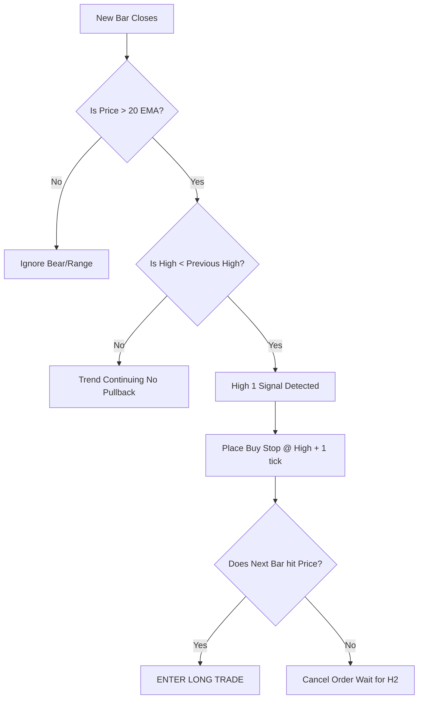
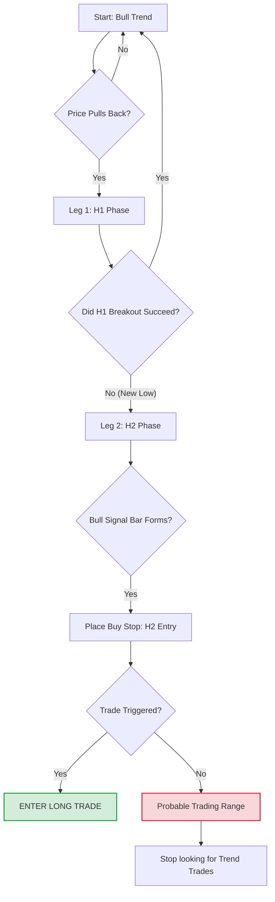

Here is the pseudo-code for a **High 1 (H1)** setup.

Since you are looking to build an automated system, you have to translate visual patterns into rigid `If/Then` statements.

### 💻 The Logic: Catching the First Breath

In a strong Bull Trend, an H1 is the very first moment the market pauses (pulls back) and then immediately resumes.

**The Real-World Analogy: The Green Light**
Imagine you are at a traffic light (the market).

  * **Green Light (Trend):** Traffic is moving.
  * **Yellow Light (Pullback/Signal Bar):** Cars slow down briefly.
  * **Green Again (Entry):** The light turns green immediately, and you step on the gas. You don't wait; you assume the traffic flow will continue.

**The Algo Challenge:**
The hardest part for a computer isn't identifying the H1; it's identifying the **Trend**. An H1 in a Trading Range is a "bull trap" (a losing trade). Your code must strictly filter for a **Bull Trend** first.

-----

### 📝 Pseudo-Code: High 1 Bull Setup

This logic assumes you are iterating through bars (candles) as they close.

```python
# VARIABLES
# Current_Bar: The bar that just closed (Potential Signal Bar)
# Next_Bar: The bar currently forming (Potential Entry Bar)
# EMA_20: 20-period Exponential Moving Average

def check_for_high_1_setup(Current_Bar, Previous_Bar, EMA_20):

    # 1. CONTEXT FILTER (Are we in a Bull Trend?)
    # Simple check: Is price above the Moving Average?
    # Advanced Al Brooks check: Are we making Higher Highs and Higher Lows?
    
    is_bull_trend = (Current_Bar.Close > EMA_20) AND (Current_Bar.Low > Previous_Bar.Low)
    
    if NOT is_bull_trend:
        return "No Trade: Context is not Bullish"

    # 2. IDENTIFY THE PULLBACK (The Pause)
    # An H1 requires the Current Bar to have a High LOWER than the Previous Bar's High.
    # This indicates a pause in the upward momentum.
    
    is_pullback_bar = Current_Bar.High < Previous_Bar.High

    if is_pullback_bar:
        # We have a potential H1 Signal Bar.
        # We now place a pending BUY STOP order.
        
        entry_price = Current_Bar.High + 1_tick
        stop_loss = Current_Bar.Low - 1_tick
        
        return Place_Buy_Stop_Order(entry_price, stop_loss)

    return "No Setup"

# 3. EXECUTION (The Trigger)
# If the Next_Bar hits the 'entry_price', the algo enters the trade.
# If the Next_Bar closes without hitting entry, cancel the order (The H1 failed).
```

### 🧠 Mentor Notes for Automation

1.  **The "Gap" Filter:** Al teaches that the best Signal Bars often have "gaps." In your code, check if `Signal_Bar.Close` is near its High (e.g., in the top 25% of the bar). If the signal bar closes on its low, it's a weak signal, even if the math says it's an H1.
2.  **Steve Dux Connection:** When Dux is shorting a stock, he is often looking for a **Failed High 1**. If your algo sees an H1 trigger, but the price immediately reverses down, that is a classic "Trap." You can program a "Reverse Strategy" to short the failure of your own buy signal.

**Hierarchy Position:**
`Algo Logic -> Trend Identification -> Bar Counting -> High 1 Setup`

-----

### 📊 Logic Flowchart

Here is how the decision tree looks for the bot:



### Next Step

The **High 1** is often lower probability because it's the first pause. The **High 2 (H2)** is the money-maker.

**Would you like the pseudo-code for the "High 2" setup?** (It involves adding a "memory" variable to your code to remember that an H1 recently failed).

This is the "Holy Grail" of Al Brooks' trend setups. Coding a **High 2 (H2)** requires your algorithm to have **memory**. It needs to track the history of the pullback, not just the current bar.

### 💻 The Logic: The Double Tap

The H2 works because the first attempt to resume the trend (H1) failed, trapping bears who thought the trend was reversing. When the second attempt (H2) triggers, those bears panic and cover, while bulls add aggressively.

**The Real-World Analogy: Shouldering a Door**

  * **H1 (Leg 1):** You slam your shoulder into a stuck door. It doesn't open. (The first pullback).
  * **Pause:** You step back to gather more momentum.
  * **H2 (Leg 2):** You slam into it a second time. This is usually when it breaks open.

-----

### 📝 Pseudo-Code: High 2 Bull Setup

This script introduces a `state` variable. We are tracking "Legs" of the pullback.

```python
# VARIABLES
# Trend_State: Global variable (Bull, Bear, or Range)
# Pullback_Legs: Integer (0, 1, or 2)
# H1_Low: Price of the lowest point of the first leg

def check_for_high_2_setup(Current_Bar, Prev_Bar, Trend_State, Pullback_Legs):

    # 1. CONTEXT CHECK
    # If we aren't trending up, we don't look for H2s (avoid chop)
    if Trend_State != "BULL":
        Reset_Pullback_Counter()
        return "No Trade"

    # 2. IDENTIFY LEG 1 (The First Pullback)
    # If we are not in a pullback yet, check if one is starting
    if Pullback_Legs == 0:
        if Current_Bar.High < Prev_Bar.High:
            Pullback_Legs = 1 # We are officially in Leg 1 (Potential H1)
            return "Pullback Started (Leg 1)"

    # 3. IDENTIFY THE FAILURE OF LEG 1 (Transition to Leg 2)
    # If we are in Leg 1, we look for an attempt to rally that fails.
    if Pullback_Legs == 1:
        # Check if an H1 triggered but price turned back down (New Low)
        if Current_Bar.Low < H1_Low: 
            Pullback_Legs = 2 # We are now searching for the H2
            return "Leg 1 Failed -> Starting Leg 2"

    # 4. IDENTIFY THE H2 SIGNAL BAR
    # We are deep in the pullback (Leg 2). We want the reversal bar.
    if Pullback_Legs == 2:
        # A Buy Signal Bar in a pullback usually closes near its high
        # OR simply, we look for the setup to break the prior bar's high
        
        is_signal_bar = (Current_Bar.Close > Current_Bar.Open) # Bullish body
        
        if is_signal_bar:
            entry_price = Current_Bar.High + 1_tick
            stop_loss = Current_Bar.Low - 1_tick
            
            # Reset counter because we are placing the trade
            Pullback_Legs = 0 
            return Place_Buy_Stop_Order(entry_price, stop_loss)

    return "Waiting..."
```

### 🧠 Mentor Notes for Automation

1.  **Complexity of "Legs":** The hardest part of automating Brooks is defining a "Leg." Sometimes a leg is 1 bar; sometimes it's 5 bars. A simple hack for your code: Use a **Oscillator** (like Stochastic or RSI) or simply count bars. If the pullback lasts more than 10-20 bars, Al Brooks says the trend is likely over and it has evolved into a Trading Range. Your code should have a `Max_Pullback_Duration` filter to stop looking for H2s if the pullback drags on too long.
2.  **Steve Dux Connection:** Dux loves the **Failed H2**. If this H2 setup triggers and then immediately reverses down again (an "L3" or Low 3), the bull trend is likely dead. This is often where Dux would enter a short, betting on a full reversal or a deep crash.

**Hierarchy Position:**
`Algo Logic -> State Machine (Memory) -> Pullback Complexity -> High 2 Setup`

-----

### 📊 Logic Flowchart (H2 Sequence)

The decision tree now has a loop to account for the first failure.



### Summary Next Step

You now have the logic for **Trends** (H1/H2). However, automated systems lose the most money in **Trading Ranges** because they keep trying to buy breakouts that fail.

Al Brooks has a specific rule for identifying when a Trend has officially morphed into a Trading Range. **Would you like to know the "Always In" logic or how to code the "Tight Trading Range" filter to prevent your bot from churning?**