# 高频交易基金与程序交易

## 高频交易本身的性质：不需要非常正确，只需要量大，即使正确率只有55% 都能挣钱

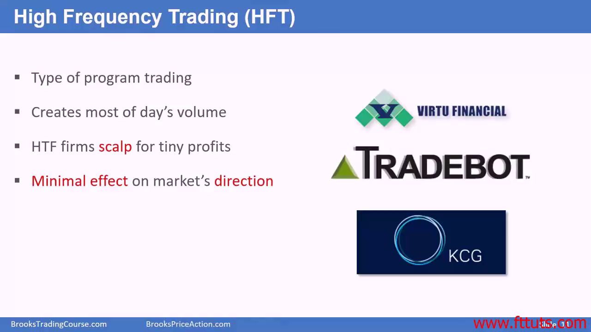

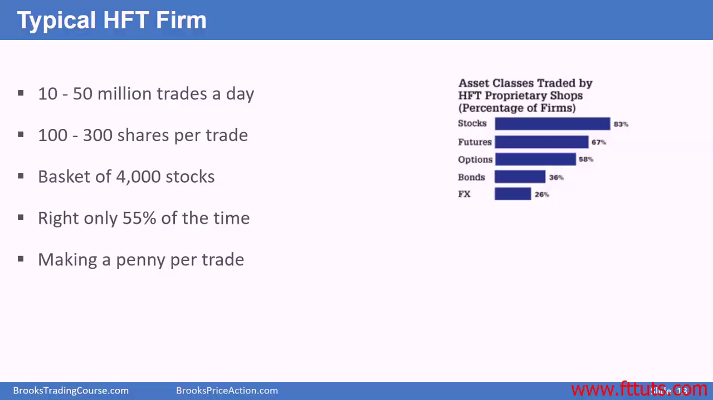

- 高频交易的利润计算公式：

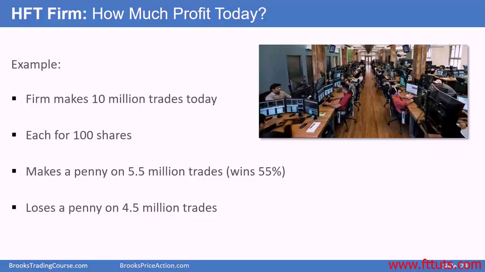

- 很多高频机构都是亏钱的，只有最头部的几个是挣钱的

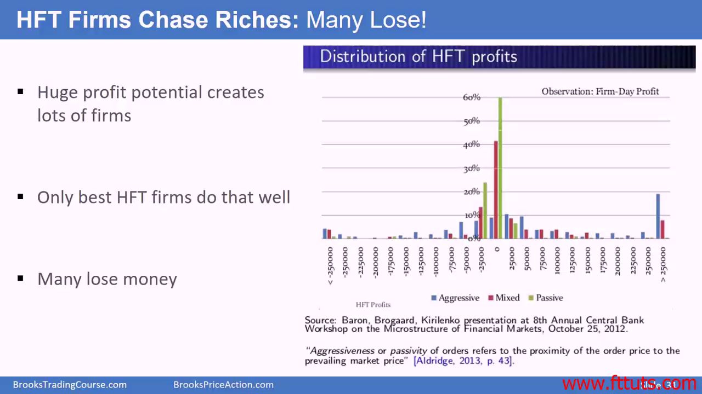

## 作为散户，你移动不了市场

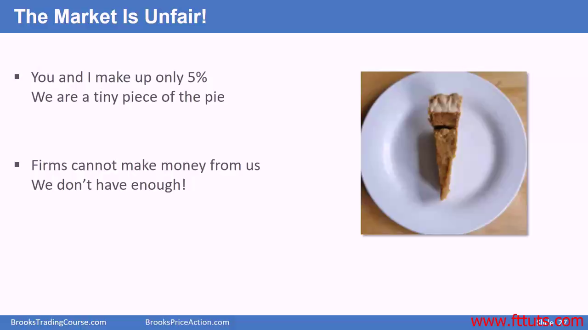

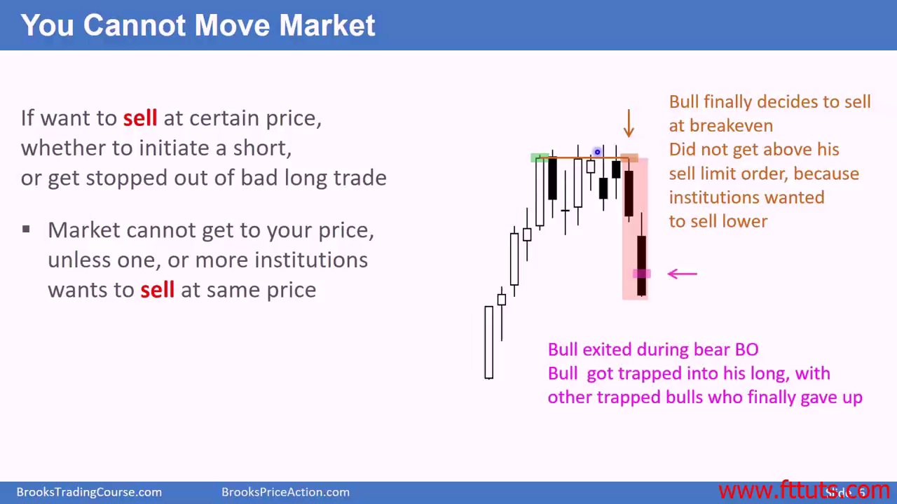

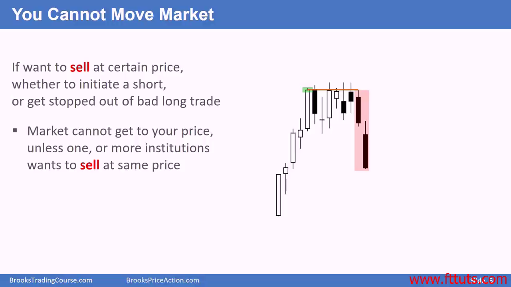

## 在市场闪崩的时候基本都是高频交易基金参与的

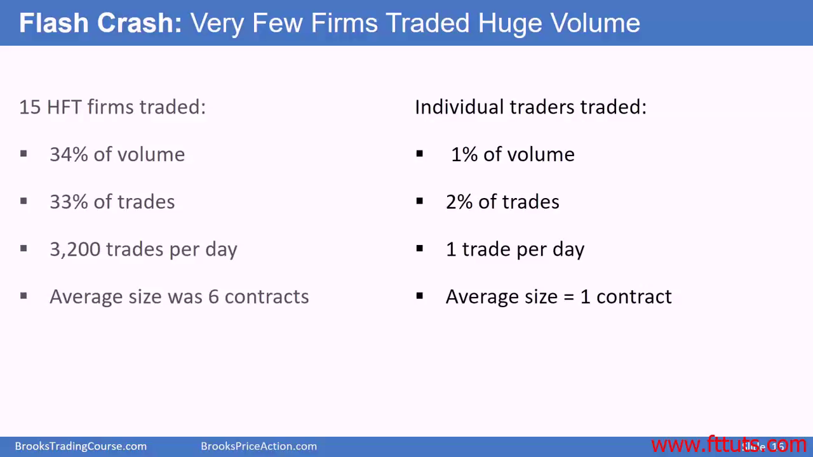

## 高频交易不能掩盖他们的价格行为

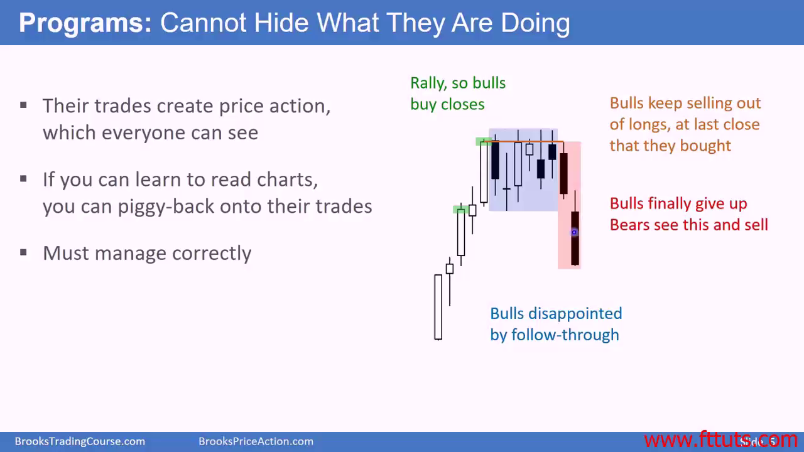

## 机构交易的作弊行为，已经被法律禁止

- 通过订单嗅探来诱多或者诱空
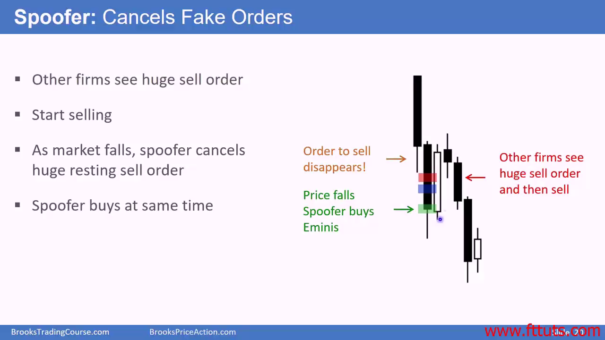
- Front-running: 抢在散户或者其他机构的订单前下对手单
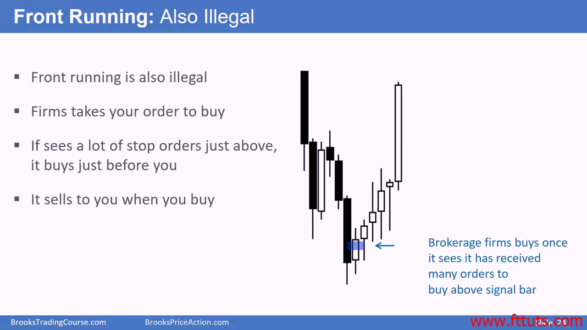
- 内幕交易
