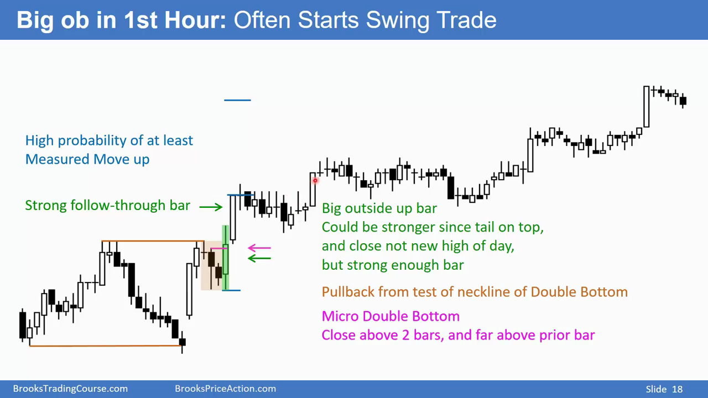
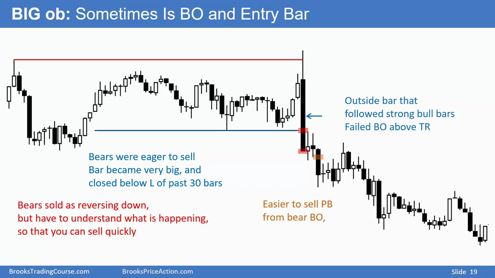
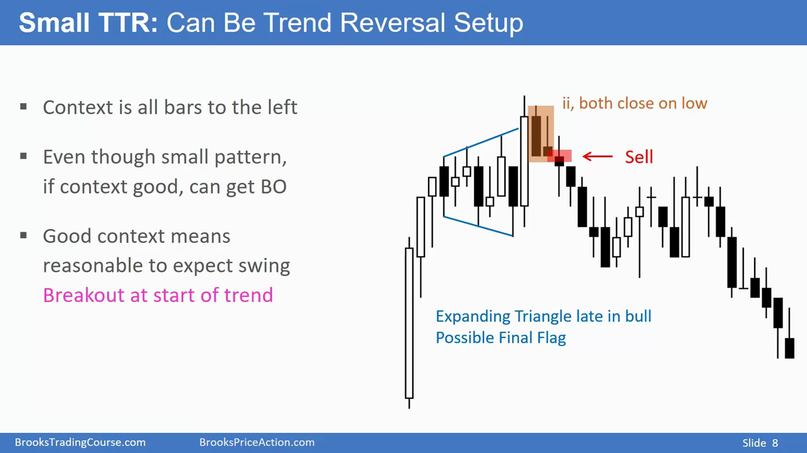
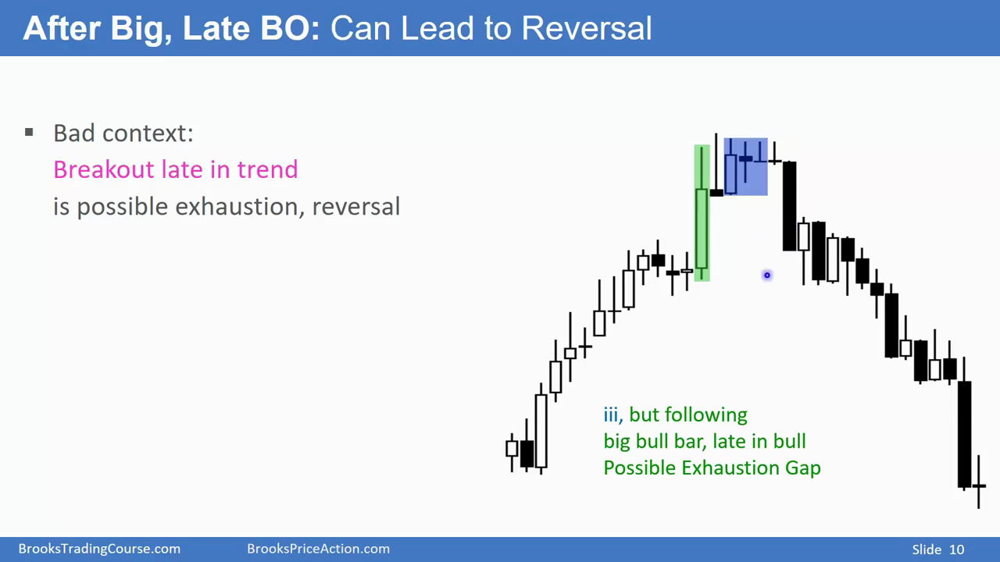
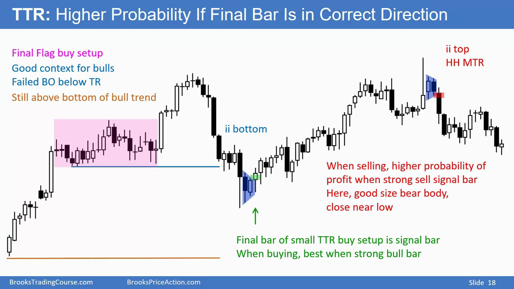

# 内包k线和外包k线

## 内包k线的第二根幅度弱于第一根，可以作为信号k线

成为一个好的信号k线需要良好的context。

## 外包k线的第二根幅度强于第一根，可以作为入场k线，或者当成趋势突破线

- 窄通道的外包k线更有可能是一根突破k线

## 再窄的区间和外包k线，也需要 context 的支持 - context 决定大方向

## 狭窄的交易区间的内部k线会有更高的回报

