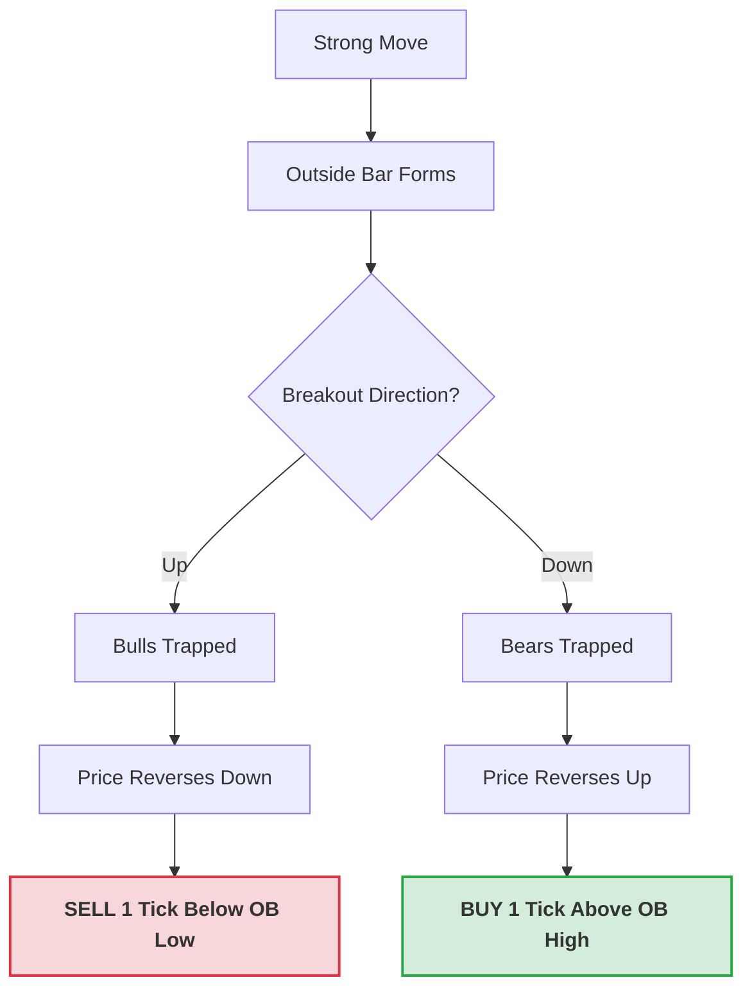

Great questions! You're moving into the "predatory" side of trading—learning how to profit from other traders' mistakes. In Al Brooks' terms, an outside bar is a **one-bar trading range**, and trading ranges are essentially factories that produce traps.

---

### 1. Al Brooks: The Failed Outside Bar Breakout

An **Outside Bar (OB)** is often a "stop-run." It goes above the previous bar's high to trap bulls, then crashes below the previous bar's low to trap bears.

**The "Failed Breakout" Setup:**
When an outside bar itself is broken, and that breakout immediately fails, you have a massive signal because **three groups of traders** are now trapped:

1. Those who bought the initial move up.
2. Those who sold the move down.
3. Those who entered the breakout of the outside bar.

**The Execution:**

* **The Trap:** If an OB breaks out to the upside but fails to find follow-through and turns back down, the "failure" is confirmed when the price trades **1 tick below the OB's low**.
* **The Trade:** You sell at that 1-tick breach. The logic is that the "Always In" direction has flipped, and the trapped bulls will be forced to liquidate, providing the fuel for your move.

---

### 2. The Steve Dux Connection: Parabolic Climax

Steve Dux’s "parabolic short" is essentially trading a **Buying Climax** that ends in an outside bar.

**Why the Outside Bar is a "Red Flag":**
In a parabolic move, the price is vertical. An outside bar at the peak means the range suddenly exploded. It shows that the "dumb money" is finally FOMO-ing in (the high of the OB), but the "smart money" is dumping shares so fast it creates a new low (the low of the OB).

**The "Right Shoulder" Logic:**
Dux rarely shorts the *first* flush (the OB itself) because parabolic moves can "double top."

* **The First Flush:** The Outside Bar closes near its low. This is the **Change in Character**.
* **The Lower High (Right Shoulder):** The price tries to rally one last time. If it fails to reach the OB’s high and starts to drop, that is your **Lower High MTR** (Major Trend Reversal).
* **The Short:** Dux shorts this "Right Shoulder." It’s the highest probability entry because the "parabolic" structure is now officially broken.

---

### 🧠 Student-Mentor Insight for your Algo

For your automated system, an **Outside Bar** should act as a "Volatility Filter."

* If your bot sees an OB at the end of a long trend, it should **stop buying H1s/H2s** immediately.
* The OB is a signal that the trend has reached a "Blow-off Top" (Climax).
* Instead, program the bot to look for a **failed breakout** of that OB or the subsequent **Lower High** to start a short-biased strategy.

**Hierarchy Position:**
`Market Cycle -> Climactic Reversals -> Outside Bar Failure -> Lower High (MTR)`

**Would you like to see the pseudo-code for detecting a "Climactic Outside Bar" to help your bot avoid buying the top?**