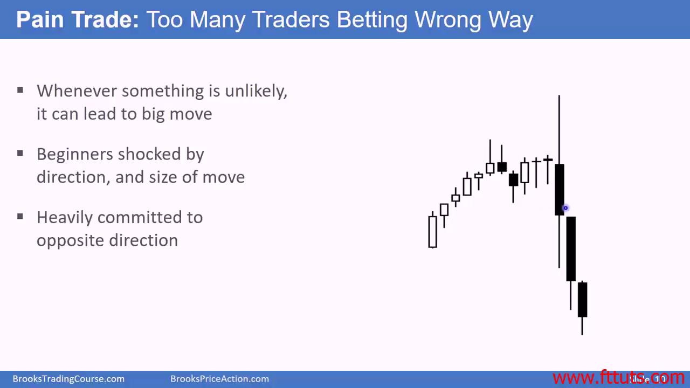
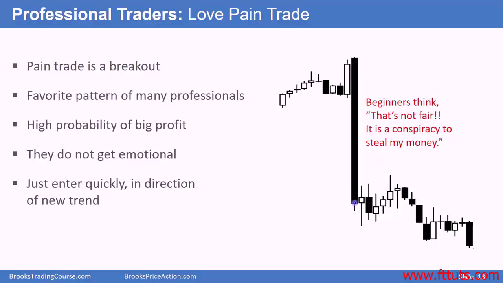

# What is pain trade?

Pain trade is the **low probability** breakout of any support or resistance levels, trading range or trend line.

- Bull/Bear breakout of bull flag
- Bull/Bear breakout of bear flag

职业交易员最喜欢pain trade 了，方向比较确定而且幅度很大。新手最怕pain trade 了，容易恐惧

90% bars are within ranges, 10% are not in range.

## Whenever something is unlikely, there're many traders betting in only one direction

- For example, in a bull flag setup, many traders bet the bull trend will keep on going, so they're heavily committed to one direction (buy pullback, buy breakouts).
- If there's a big bear bar, many such heavily committed trader will be too fear to hold on, they will sell, fueling the bear reversal.

- The worst thing is, traders usually exit too late to prevent bigger loss, and too upset to enter in new trend
- 专业交易员根本不会挫折交易被影响，他们已经被打脸过很多次了。如果他们赌方向正确，他们会scale in 买入更多，相信市场会回到原来的价位
  - 他们知道 20% 的可能 breakout 会成功，80% 可能breakout 会失败。所以如果buy high 被市场打脸了的话，就在底部价位继续买入；如果 sell high 被打脸了的话，就在更高处继续卖出。
  - 最终市场会有一个成功的突破，延续之前的趋势。breakout 之前市场都会展示一些线索的。但能否真正成功 breakout 也都是概率，不是100%的事件

