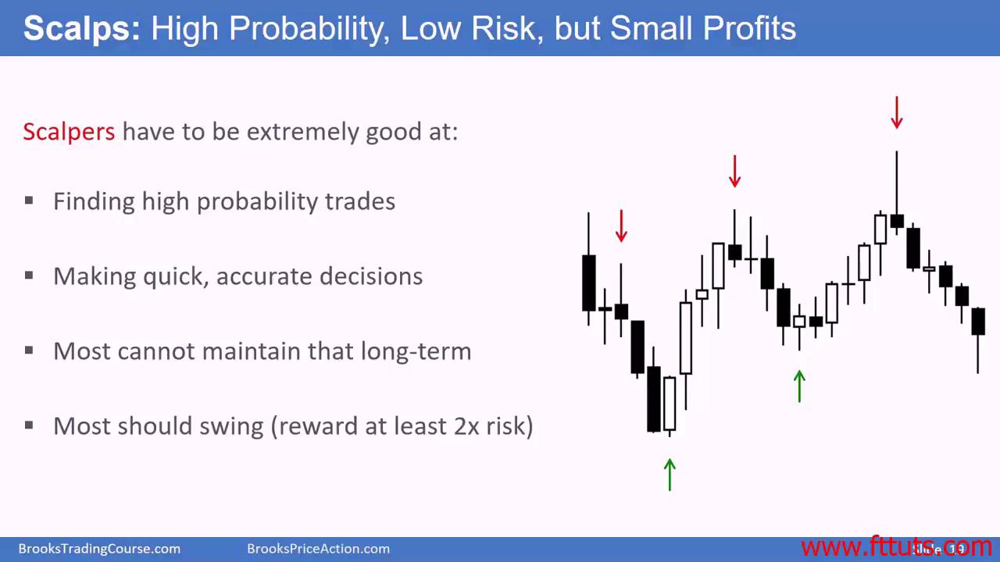
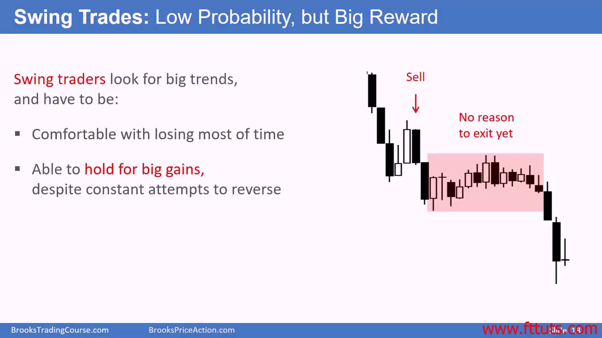
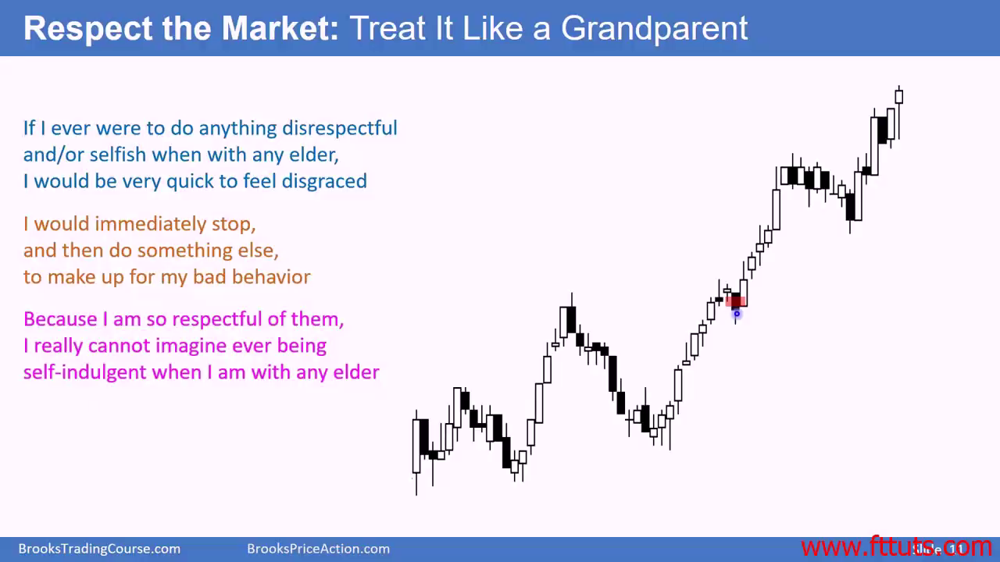
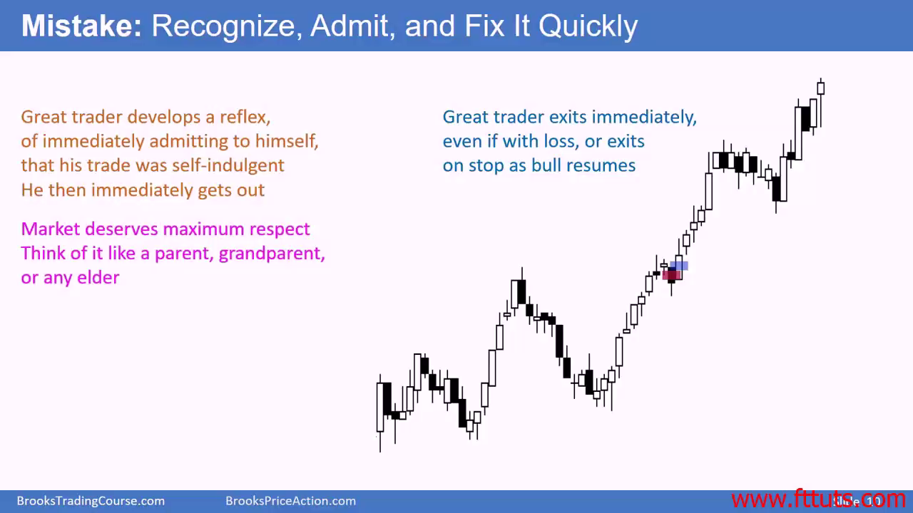
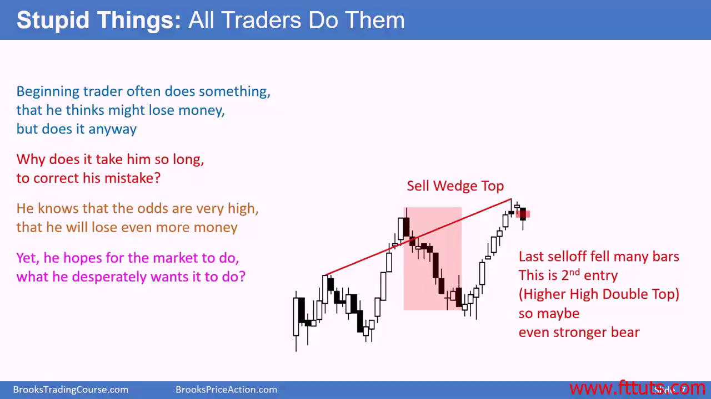

# 成功交易员的人格

## 纪律性 - 不要“觉得”可能会行

- Doing what's right, when you do not want to do it
- 市场从来不会因为你的期望或者希望达到的价位就反转。你时刻要准备好40% 失败的情况

## 有耐心

交易的概率 = 给定一个setup，求在后续出现多少次

按交易成功的概率分，有两种交易策略

1. 追求高盈亏比的模式，成功拿到的概率就必然低。
2. 追求高概率大模式，盈亏比就差强人意

如果你交易策略第一种偏多，那么就需要有耐心等待，可能一个交易日需要等几个小时或者等几天才会出现一次

**注意⚠️**：不要因为一次交易的风险低就参与，初学者看风险低，但并没有意识到成功的概率不高。一个形态更有可能失败的时候，交易者收入的期望是亏钱的

## 尊重市场

- 像尊重老者一样尊重市场规律，市场运行了数千年了，根本现象经常出现

- 成熟的交易员也有出错的时候，他们和新手的区别是，成熟交易员会很快承认自己错误

## 学会与不确定性相兼容

- Clarity exists only briefly, usually 60% time you live with uncertainty
- Loss is inevitable
- Nothing is clear in real-time

## 学会找到最舒服的交易模式

- You must be comfortable because you're doing this for many years
- It must be enjoyable and miserably stressful

## 找到一个最舒服的交易方式，有一千种方式去挣钱

- 海豹突击队训练法则：当你内心觉得已经做完了，实际上只完成了40%
