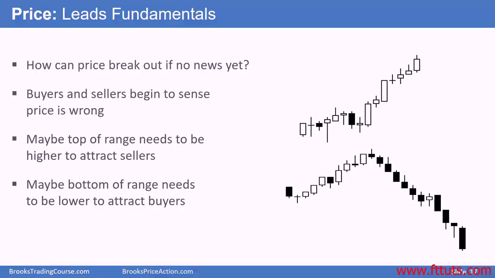

# Price leads fundamentals

- Before news come out, price will start to move

价格向上突破或向下突破都是多空双方共同作用的结果：向上突破时，空方放弃了做空，希望在更高的价位开空仓；向下突破时，多方放弃了做多，希望在更低的价格买入

- Tight trading range = bulls don't want to buy high & bears don't want to sell low

**很多时候，在新闻发布之前，价格就会开始移动**

