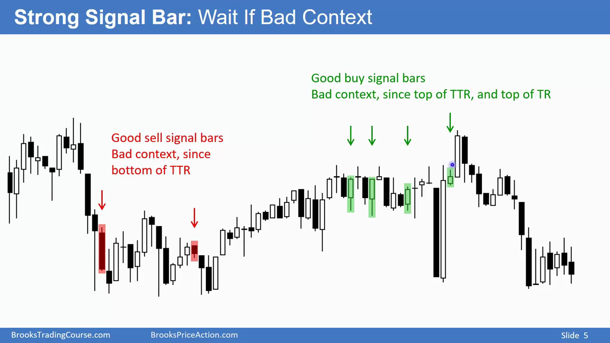
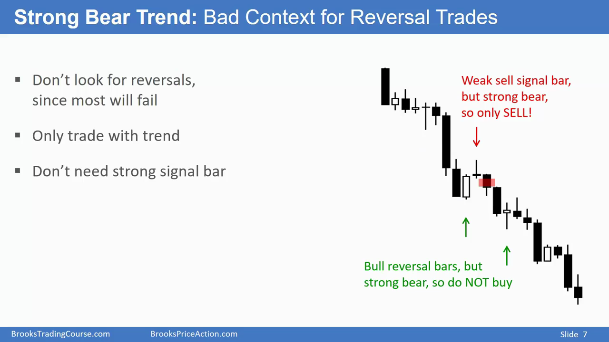
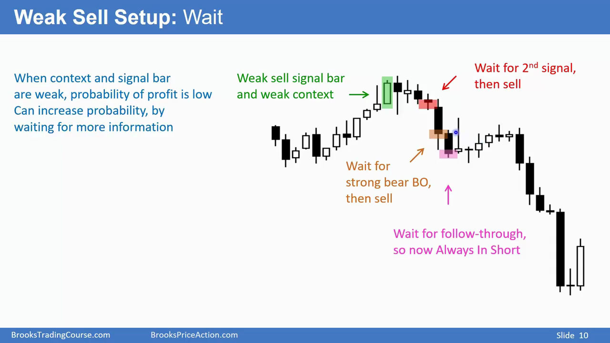

# 交易入场条件

## 一般来说，入场条件由两个决定：信号k线和上下文，上下文起决定性的作用，而k线提供入场信号

 如果只有一根强信号k线是不够的，必须有好的，明显的上下文来决定这根信号k线是否有用

- Example 1: Tight trading range context

- Example 2: Bear trend context

## 如果信号很弱，那么需要等更高胜率的入场信号，或者小仓位开仓，然后要么设置宽止损(wide stop)，或者提起设定好加大仓价位(scale in)

注意⚠️：**高胜率对应低盈亏比，例如宽止损**

