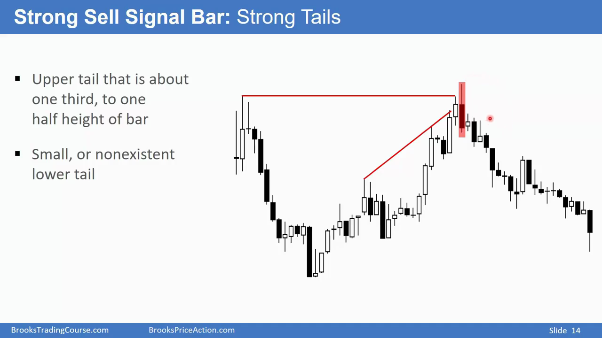
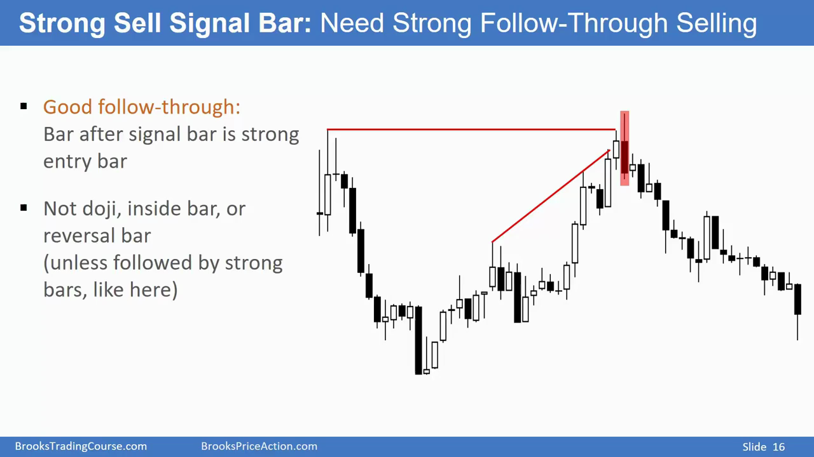
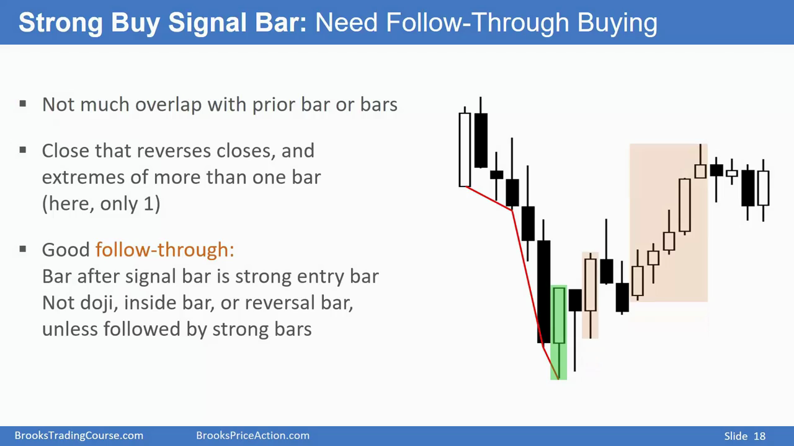
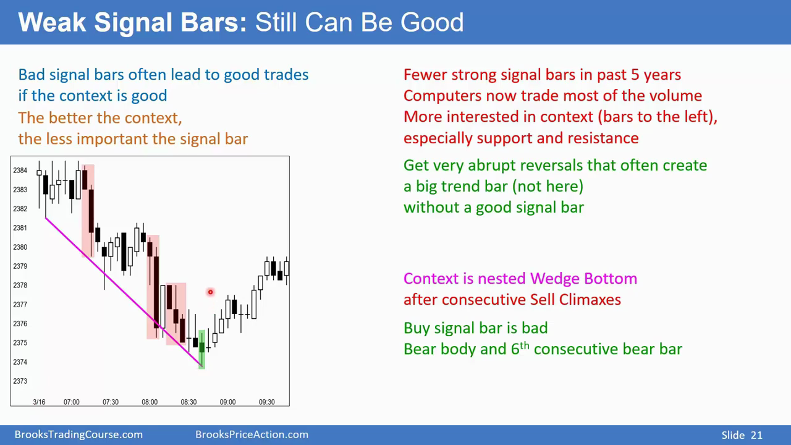
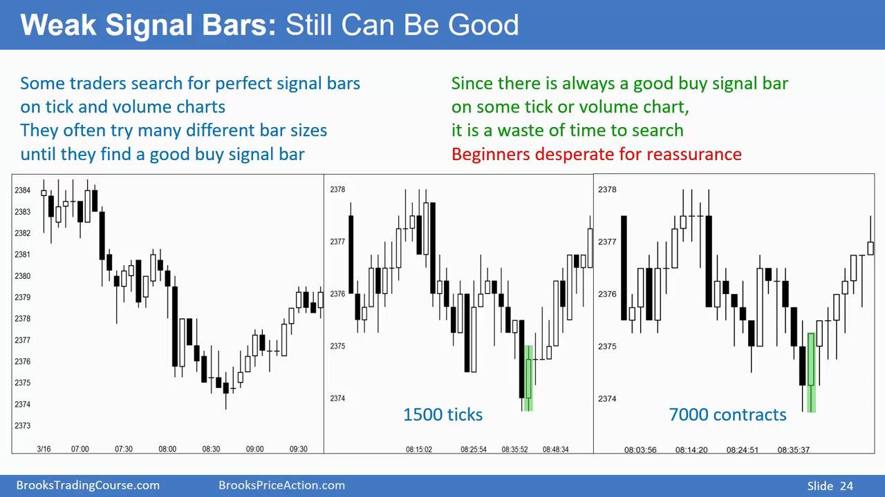
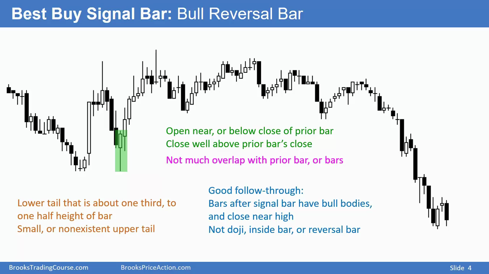
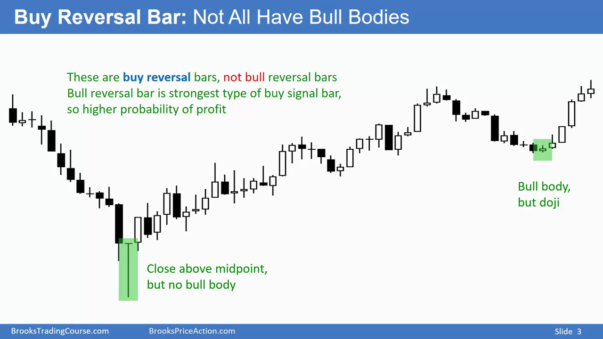

# signal bars

- 并不是所有信号k线都是非常强的k线。Strong signal bars are **rare**. 还是要看上下文
- 有经验的交易员可以在大多数普通k线上看出信号（但不一定要入场或者执行其它操作）
- signal bar != strong reversal bars

## 那究竟该选择哪种信号k线入场呢？

要考虑tradeoff：在趋势已经确立的前提下，在趋势发展了一段时间后再入场，胜率更高，但是距离最佳止损点（趋势开始位置）更远，如果趋势失败的话亏损更多，且止盈利润空间更少；在趋势未明确情况下入场，胜率更低，但距离最佳止损点更近，如果趋势失败，不按预期走的话亏损更少，且止盈利润空间更高。  
两周入场都是可接受的

## 顺趋势强信号k线的例子（不一定灵）需要依据上下文决定，需要多个信号验证

## 顺趋势弱信号k线例子（有可能灵验）需要依据上下文决定，需要多个信号验证

有些新手交易员会切换不同时间尺度的 bar chart，希望找到一个完美的bar chart，寻找进场点，实际上没有完美的chart 可以让你解读市场。这么做只是徒劳地去寻找自欺欺人的自我确认罢了

### 逆转强信号k线：k线本身是逆转方向的实心

### 并不是所有逆转信号逆转弱信号k线：k线本身是反逆转方向的实心

