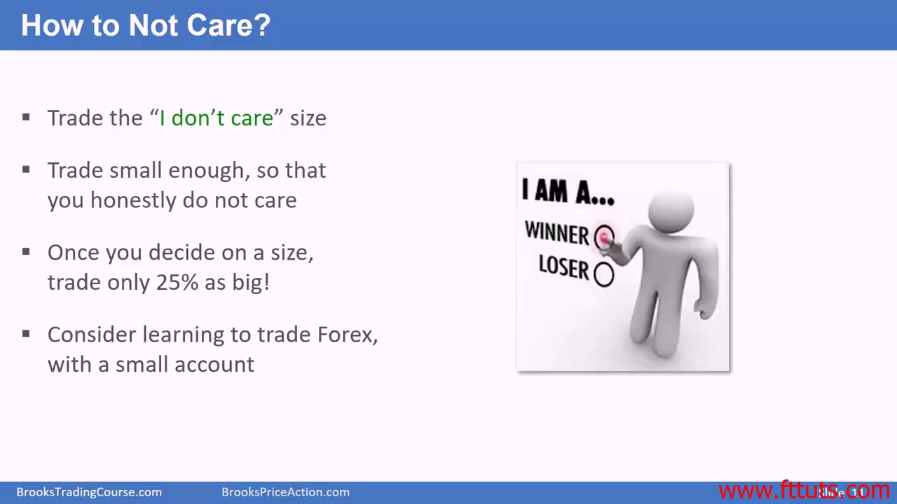
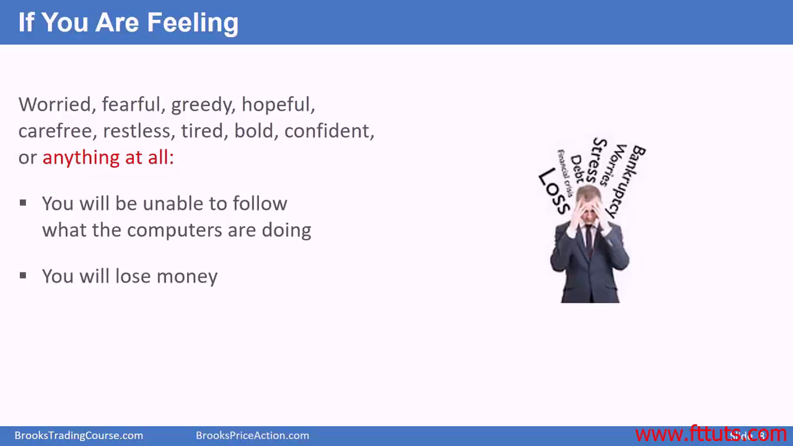
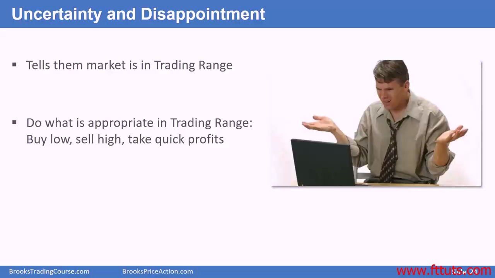
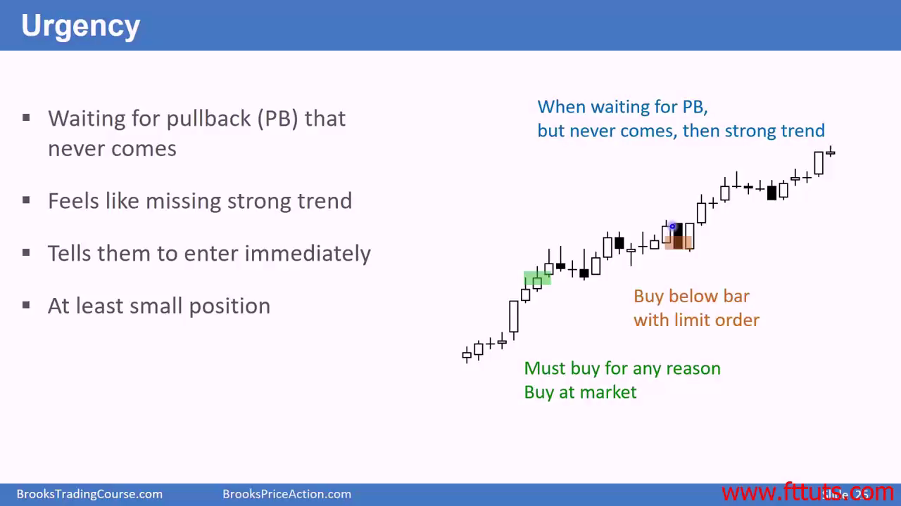

# 新人开始交易

## 在开始进行频繁的日内交易的时候，最好挑剔一些，不要什么交易机会都想着参与一脚

- 一天只进行 1-3 次波段交易，选择最好的 setup。Buy low sell high, buy 50% pullback, etc.
  - 查看 "best trade" 的笔记

## 累积利润计算

- 股指期货：如果你一天交易能捕捉到 ES mini 的一个点，一天交易 10 个合约，一年就是 10w 刀，25 个合约一年就是 25w 刀。100 个合约，一年就是一百万刀
- 外汇：如果一天一笔交易能捕捉，50万单位，一年利润 10w 刀，一笔交易5百万单位，一年利润 100w 刀

## 价格行为暴露了机构的足迹，你必须跟随这些足迹去进行操作，而不是跟他们对着干

## 新人交易仓位尽可能地小，因为一开始会亏很长时间

## 恐惧与贪婪

恐惧与贪婪只在文学影视作品中存在，现实世界并不存在恐惧与贪婪。  
初学者会恐惧哪些事情呢？

- 亏大钱，对他们来说基本和死刑差不多
- 被社会上看作是一个成瘾的堵君子，很弱
- 配偶的焦虑与不满与生气的情绪会影响自身
- 比他自己认为的更成功，怕担不起这份回报

职业交易员看着市场的起起伏伏，他在开仓之前就已经接受了40%情况是有亏损的可能。所有事情都可能发生。即使开仓之后一根大红柱砸下来，都不怕，no big deal，因为有止损点位.

职业交易员的下一笔交易开仓不会受到上一笔亏损的影响

职业交易员从来不会把自己暴露在太多的风险之中。就算scale in 加仓也不会比其它 trade 更大的风险

## Skilled traders are confident to even handle a crash

- As action unfolds, they get more information, waiting & exiting
- They always takes some profit, if that's good enough for probability and risk, or all profits off

## If a person is greedy, they want more than what is logical

- Must have **logical** approach to management, else greedy person will lose!!

## 交易员也是人，也会有感情

- 用人类的感情去捕捉市场的机会，感觉市场的走势，而不是影响你买入/卖出的决策！

- 如果你感到当前市场走势犹豫不决，或者感到失望（买入后价格移动没有到预期的目标），那就是交易区间；如果感到错过了一个强势走势，那就是 breakout trend

## 交易很难，成为一个持续盈利交易员

成功交易员在当日交易结束时都会做交易记录，持续做记录直到他们交易下单成为了一种本能，**反射式的本能**，看一眼图表就知道怎么操作的熟练程度

不需要单笔交易完美，但大体上需要持续做到专业交易员能打败新手的程度
