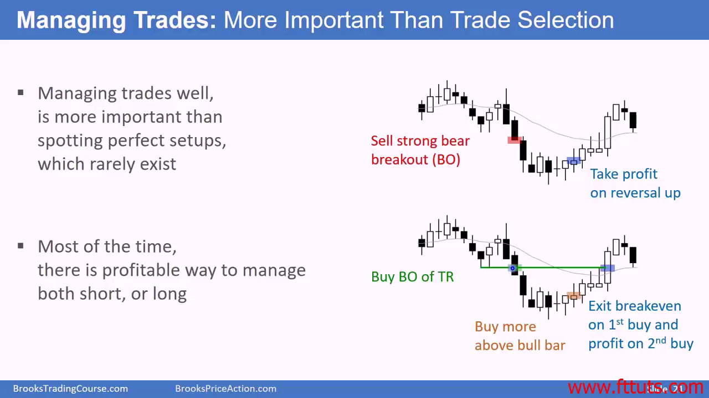
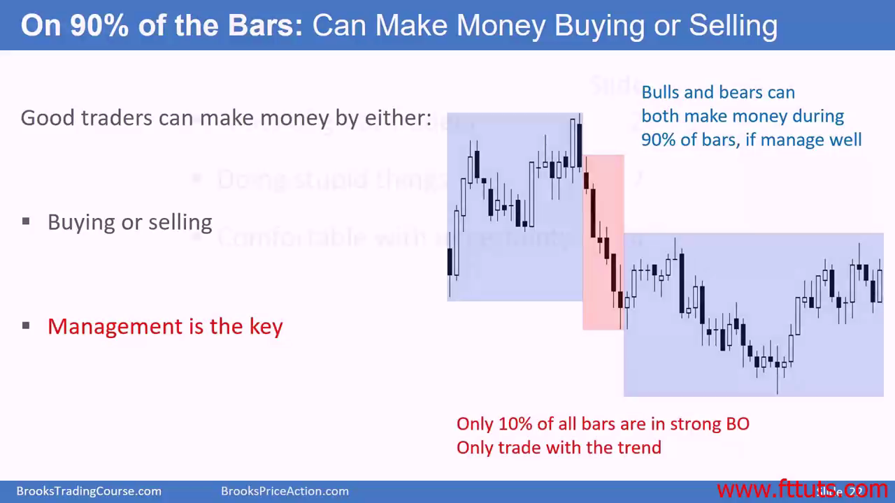
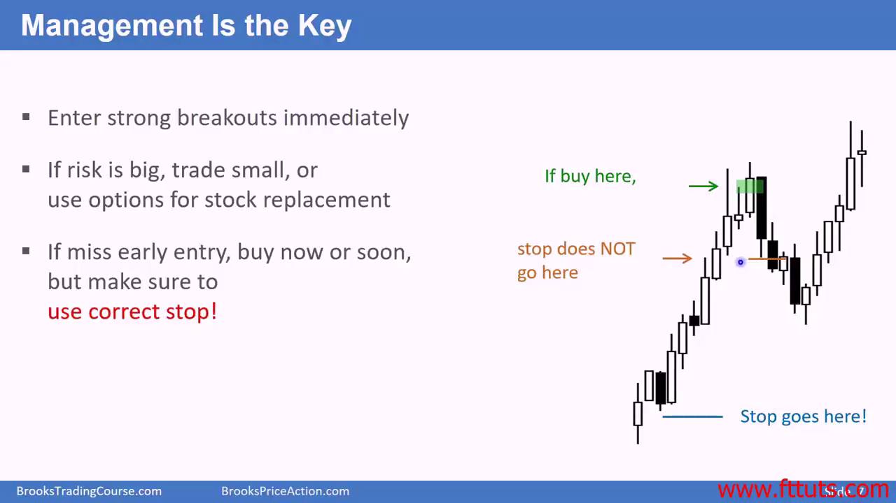

# 交易管理比技术分析入场点位更重要

## 就算一开始做错了方向，后面也能继续补回来

## 方向其实没有那么重要，90% 的 bar 都能通过做多和做空两个方向盈利，因为他们在一个区间或者一个channel里面上上下下的震荡

Manage to scale in, buy or sell, ups and downs

只有10%的强突破k线是单方向的

## 所以一旦有强突破和明显趋势，你需要立即买入/卖出，此时任何价位都是合适的入场价位

## 可以用期权来作为股票的代替，不用占用账户那么多资金，而且risk 的仓位也小得多

- 如果跌了相同的 dollar value, 那么正股跌去的总价值更多。期权是不成比例的跌幅，大不了就亏掉权利金而不是成比例的 dollar loss * position

## 就算错过了早起的入场点位，止损点也要依照涨幅正确设置。止损点和你入场的价位没有太多关系，但是和起涨点有关系

如果用了不正确的入场点位（依照入场点位设置的止损，而不是依照走势图形学设置的止损），那么容易被一个pullback 直接打出局

