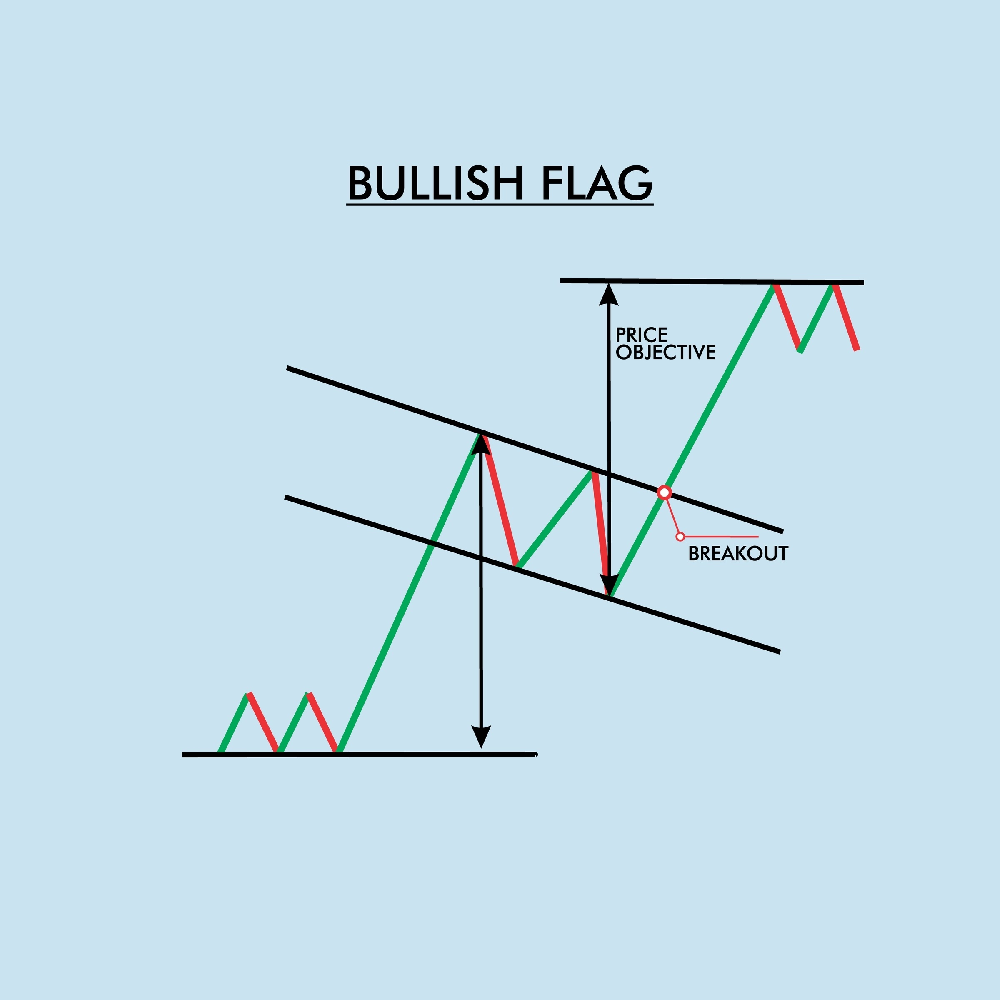

# Wedge vs. Flag

Here is the breakdown of how to distinguish wedge vs. flag pattern and how to trade them.

## 1. The Wedge Pattern (The Reversal)

A **Wedge** is a pattern of **exhaustion**. It tells you the current trend is "tired" and likely to reverse or go sideways.

* **Structure:** Three pushes in the direction of the trend.
* **Shape:** The trend lines **converge** (point toward each other). The volatility is shrinking.
* **Psychology:** The bulls are pushing for new highs, but each new high is marginal. They are putting in maximum effort for minimum result.
* **Automation Logic:** Look for 3 extremes where the angle of ascent/descent is flattening.

## 2. The Flag Pattern (The Continuation)

A **Flag** is a pattern of **respite**. It tells you the trend is "resting" and likely to resume its original direction.

* **Structure:** A pullback against the trend (e.g., price drops in a bull trend).
* **Shape:** The trend lines are often **parallel** (a channel).
* **Psychology:** Early traders are taking profits, but no new aggressive counter-trend traders are entering. The market is waiting for the next leg up.
* **Automation Logic:** Look for a counter-trend channel where the slope remains constant (parallel).

---

### ⚔️ The Comparison: Wedge vs. Flag

| Feature | Wedge | Flag |
| --- | --- | --- |
| **Primary Function** | **Reversal** (Ends the trend) | **Continuation** (Pauses the trend) |
| **Trend Lines** | **Converging** (Triangle-like) | **Parallel** (Channel-like) |
| **Pushes** | **3 distinct pushes** (waves) | Usually **1 or 2 legs** |
| **Volume** | Declining (drying up) | Declining (drying up) |
| **Target** | The **start** of the wedge | A **Measured Move** (Leg 1 = Leg 2) |
| **My Mentor Tip** | "Do not buy the breakout of a rising wedge." | "Buy the breakout of a bull flag." |

---

### 🧠 The Al Brooks Nuance: The "Wedge Flag"

Here is where it gets advanced (and where the code gets tricky).

Sometimes, a **Flag** can be shaped like a **Wedge**.
If a strong Bull Trend pulls back in a shape that has 3 pushes down and converging lines, Al Brooks calls this a **Wedge Bull Flag**.

* **It is NOT a reversal pattern** because it is occurring *against* the main trend.
* **It IS a continuation pattern.**
* **The Rule:** A wedge formed **with** the trend is a Reversal. A wedge formed **against** the trend is a Flag.

**Hierarchy Position:**
`Chart Patterns -> Trend Continuation (Flags) vs. Trend Termination (Wedges)`