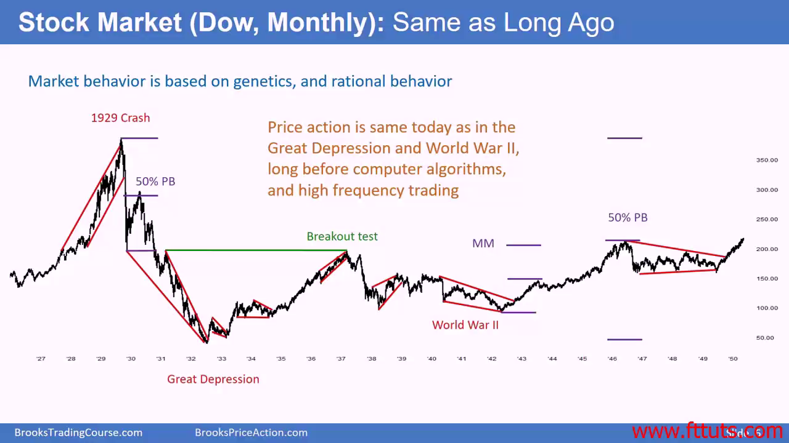
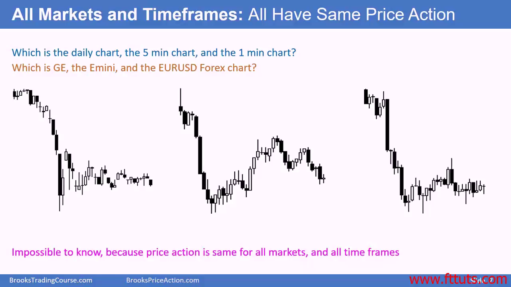

# Al brooks' price action: Every is important

## 原则：Principles

- Do not dismiss anything: 每根k线都很重要
- Very often something that initially appears minor, leads to great trade
- "Noise" implies random moves, many candlestick moves are NOT noise
  - Noise only exist in minds of ignorant traders, who simply don't understand what market is doing

## Price action principles are encoded into human genes

- Reflects human (rational) behavior
- Our behavior is due to our genes
- Current market is still running same principle as 30 years ago
- Will remain same until evolve into new species

## Market structure now vs. then. Not so much difference huh?

## Same timeframe has same price action

