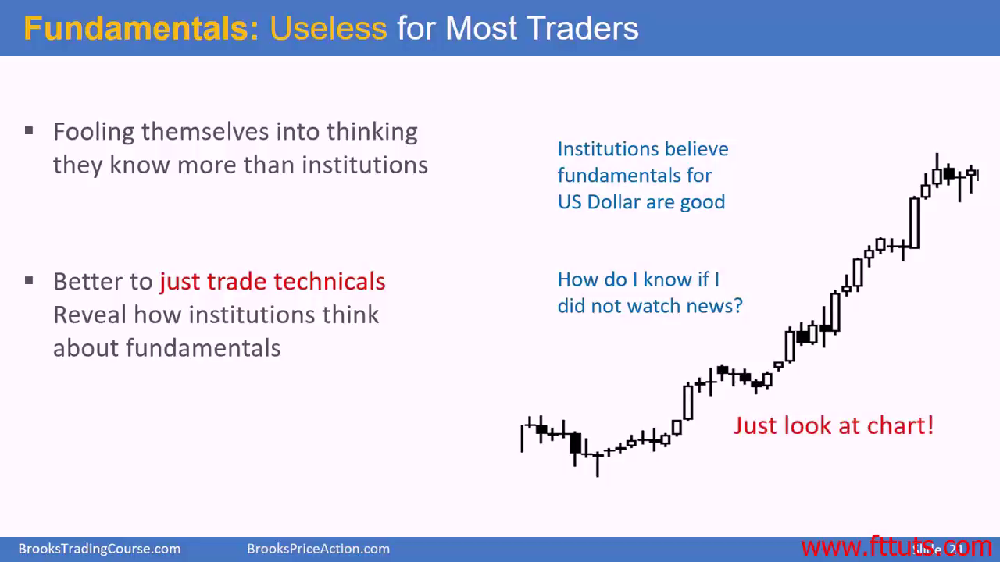
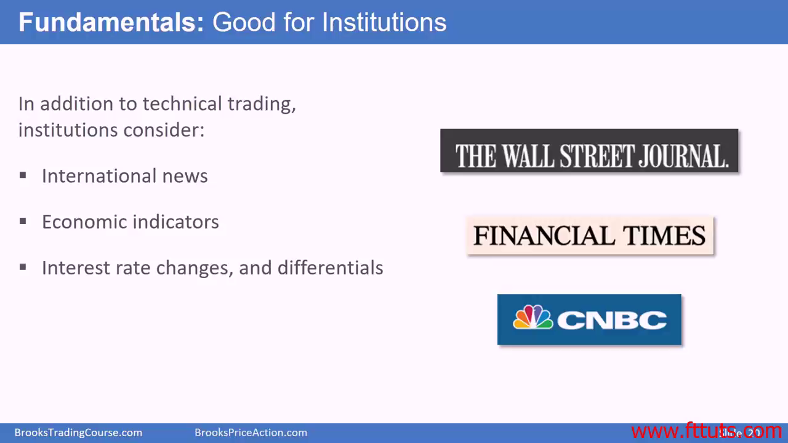

# Fundamentals are useless for most traders

- Fooling themselves into thinking they know more than institutions
- Better to **just trade technicals**, trend reveal how institutions think about fundamentals
- Just look at charts

## Fundamentals are only good for institution but useless for traders

