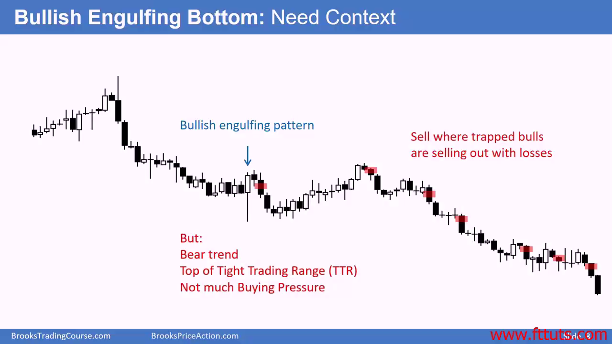
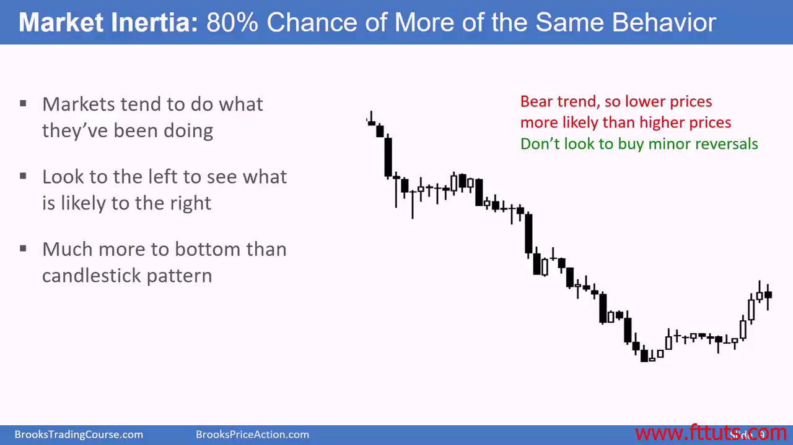
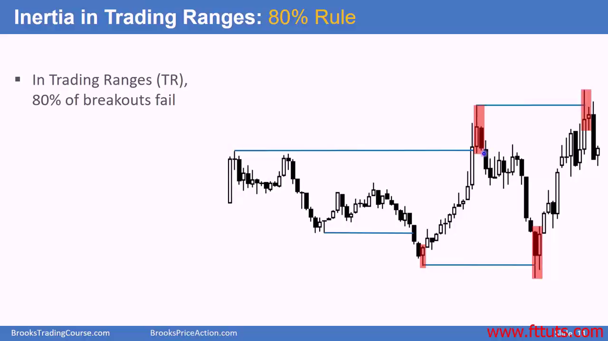
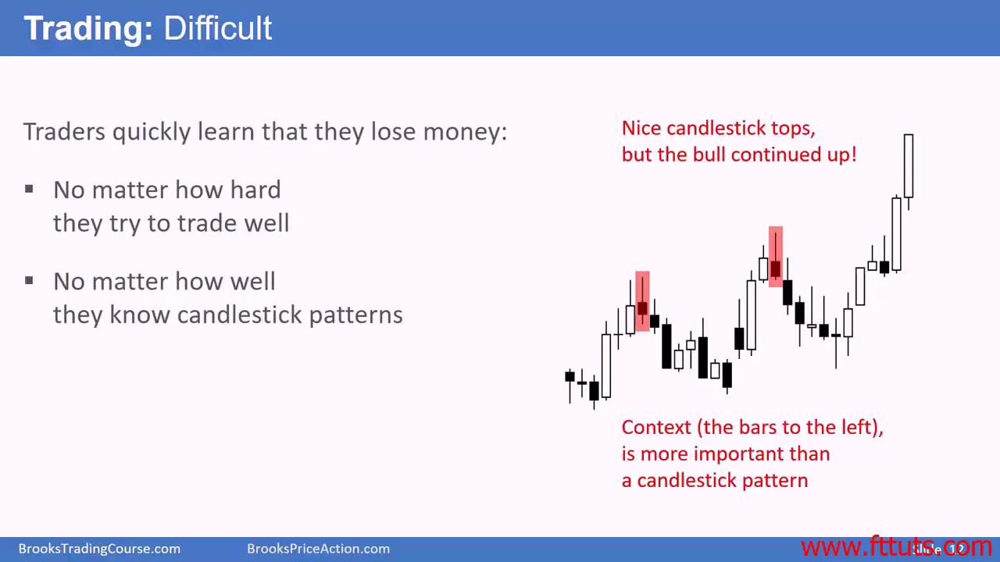
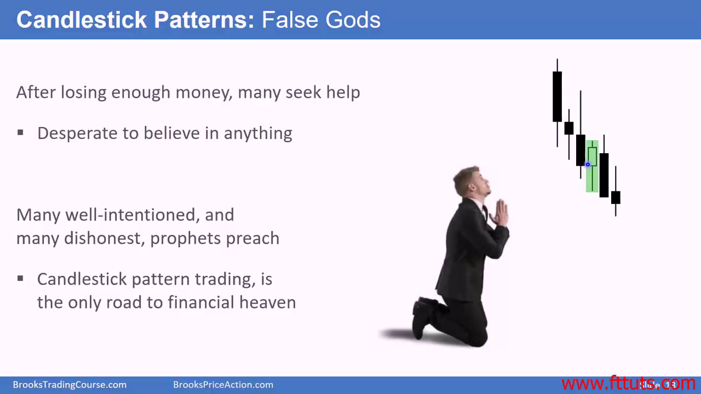

# 为什么不依据交易k线形态交易？

k线形态指短短 < 3 根k线的组合。仅仅看几根k线完全不能得出大趋势。如果目前趋势是下跌，看涨k线形态也不能扭转熊市的趋势.

趋势通道的宽窄也会作用于 k线形态 的影响力：

- 看涨k线形态出现在看跌通道/range上面，反而是一个好的做空入场机会
- 看跌k线形态出现在看涨通道/range下面，反而是一个好的做多入场机会

## Market inertia: 80% chance of more of same behavior

不看环境/大趋势上下文的交易员一定是失败的。上下文指发生在左边已经发生了的k线

- Market tends to do what they've been doing
- Look to the left to see what is likely to the right
- Much more to bottom than candlestick pattern

People often misunderstand context, this makes trading difficult

Candlestick pattern is false god

